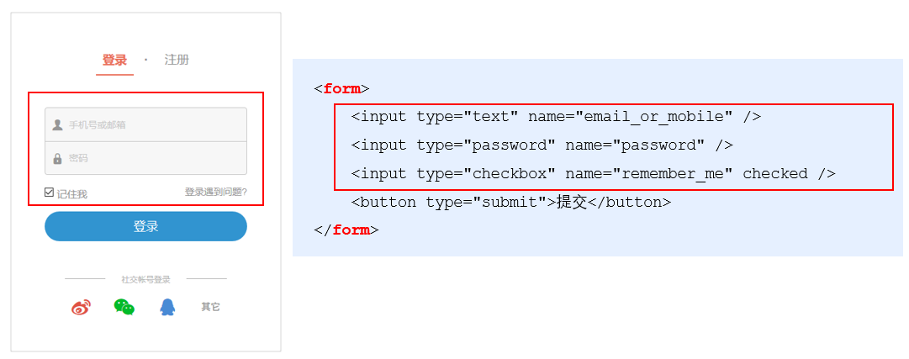

# Form表单和模板引擎

## 1.form表单的基本使用

**1.1**表单在页面中主要负责**数据**采集工作。HTML中的`<form>`标签就是菜及用户输入的信息，并通过`<form>`标签的提交操作，把采集的信息提交到服务器进行处理。



**1.2**表单由三个基本部分组成：

- 表单标签
- 表单域:包含了文本框、密码框、隐藏域、多行文本框、复选框、单选框、下拉选择框和文件上传框等。
- 表单按钮

**1.3**`<form>`标签的属性

> `<form>`标签用来采集数据，`<form>`标签的属性则是用来规定如何把采集到的数据发送到服务器。

| 属性      | 值      | 描述      |
| ---------- | ---------- | ---------- |
| action | URL地址 | 向何处提交表单信息 |
| method | get或post | 以何种方式提交表单信息 |
| enctype | `application/x-www-form-urlencoded`或 `multipart/form-data` 或 `text/plain` | 发送时编码方式 |
| target | blank self parent top framename | 在和书打开 action URL |

1.action:向何处发送表单数据,未指定时默认为当前页面的URL地址，提交表单后会立即跳转到action属性指定的URL地址

2.target:规定在何处打开action URL
  |值|描述|
  |--------------|----------------|
  |_blank|在新窗口打开|
  |_self|默认。在相同的框架中打开|
  |_parent|在父框架集中打开（罕见）|
  |_top|在整个窗口中打开（罕见）|
  |framename|在指定的框架中打开（罕见）|

3.method:以何种方式提交表单数据到action URL

4.enctype:发送数据之前如何对其进行编码
  |值|描述|
  |-------|-------|
  |application/x-www-form-urlencoded|在发送前编码所字符|
  |multipart/form-data|不对字符编码|
  |text.plain|空格转换为'+'，但不对特殊字符编码|

**注意：**

在涉及到文件上传时必须将`enctype`的值设置为`multipart/form-data`

如果表单不涉及文件上传操作，则将`enctype`的值设置为`application/x-www-form-urlencoded`即可\

## 2.通过Ajax提交表单数据

### **2.1**监听表单提交事件

在jquery中可以用如下两种方式

```js
$('#form').submit(function(e) {
    e.preventDefault()
})
$('#form').on('submit', function(e) {
    e.preventDefault()
})
```

## 模板引擎

### art-template标准语法

1.art-template 提供了 {{ }} 这种语法格式，在 {{ }} 内可以进行变量输出，或循环数组等操作，这种 {{ }} 语法在 art-template 中被称为标准语法。

2.标准语法 - 输出

```js
{{ value }}
{{ obj.key }}
{{ obj['key'] }}
{{ a ? b : c }}
{{ a || b }}
{{ a + b }}
```

在 {{ }} 语法中，可以进行变量的输出、对象属性的输出、三元表达式输出、逻辑或输出、加减乘除等表达式输出。

3.标准语法 – 原文输出

```js
{{@ value }}
```

如果要输出的 `value` 值中，包含了 HTML 标签结构，则需要使用原文输出语法，才能保证 HTML 标签被正常渲染。

4.标准语法 – 条件输出

如果要实现条件输出，则可以在 {{ }} 中使用` if … else ``if … /if `的方式，进行按需输出。

```js
{{ if value }} 按需输出的内容 {{ /if }}
{{ if v1 }} 按需输出的内容 {{ else if v2 }} 按需输出的内容 {{ /if }}
```

5.标准语法 – 循环输出

如果要实现循环输出，则可以在 {{ }} 内，通过 `each` 语法循环数组，当前循环的索引使用`$index` 进行访问，当前的循环项使用 `$value` 进行访问。

```js
{{ each arr }}
    {{ $index }} {{ $value }}
{{ /each }}    
```

6.标准语法 - 过滤器

`{{ value | filterName }}`

过滤器语法类似管道操作符，它的上一个输出作为下一个输入。
定义过滤器的基本语法如下：

```js
template.defaults.imports.filterName = function(value) { /*return处理结果*/ }
```

举例

```js
<div>注册时间：{{ regTime | dateFormat }}</div>
```

定义一个格式化时间的过滤器 `dateFormat` 如下：

```js
template.defaults.imports.dateFormat = function(date) {
    const y = date.getFullYear()
    const m = date.getMonth() + 1
    const d = date.getDate()

    return y + '-' + m + '-' + d
}
```

## 正则与字符串操作

`exec()`函数用于检索字符串中的正则表达式的匹配

如果有匹配值返回该匹配值，否则返回null

```js
const str = 'hello'
const pattern = /o/
console.log(pattern.exec(str)) // ["o", index: 4, input: "hello", groups: undefined]
```
