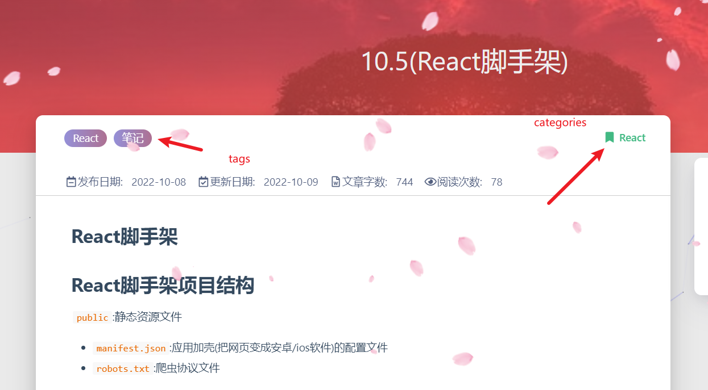

## hexo博客主题安装与修改

### **1.主题下载与安装**

点击[下载地址](https://codeload.github.com/blinkfox/hexo-theme-matery/zip/master)下载master分支的最新稳定版的代码，解压缩后，将hexo-theme-matery的文件复制到hexo的theme文件夹中即可

当然你也可以在你的站点目录文件夹下使用 git clone 命令来下载：直接在站点根目录下执行下面的命令，即可进行主题的下载，主题有两个版本，稳定版本和最新版本(不定期更新优化)，自主选择版本。

```js
git clone https://github.com/blinkfox/hexo-theme-matery themes/matery     # 稳定版
git clone -b develop https://github.com/blinkfox/hexo-theme-matery themes/matery   #最新版(不定期进行优化更新)
```

### **2.主题配置**

2.1 **切换主题**

进入根目录下的_config.yml中，往下滑到大概101行有一个theme，将它改为刚才你引入到根目录theme下的文件夹的名字就行，记得theme:后加一个空格
即theme: 你引入的文件夹的名字（不用加引号）

语言选择：如果为中文用户，则在language:后添加值zh-CN，如果不修改，默认为英语；
网址修改：url:的值为你的网址名，如<http://xxxx.github.io>，如果有域名，则修改为你的域名即可
点配置文件有个per_page属性，建议修改为6的倍数，这样网站在适应设备时，有较好的显示效果。

2.2 **新建页面**

本次操作需要新建'tags','categories','about','contact'(留言板（可选）),'friends'(友情链接(可选))
基本操作都是一样
以'tags'为例

tags 页是用来展示所有标签的页面，如果在你的博客 source 目录下还没有 tags/index.md 文件，那么你就需要新建一个，命令如下

```js
hexo new page "tags"
```

编辑你刚刚新建的页面文件 /source/tags/index.md，至少需要以下内容：

```yml
---
title: tags
date: 2018-09-30 18:23:38
type: "tags"
layout: "tags"
---
```

其他页面的新建也是如此，将tags改为对应的就行，如about，把上面的tags都改为about就行

tags和category用法
你新建玩tags和category页面以后

在你写post中的md文件时在顶部加入以下代码

```yml
title: 10.5(React脚手架)
categories: React
tags:
  - React
  - 笔记
```

就会生成以下效果



新建friend页面后同时，在你的博客`source`目录下新建`_data`目录，在`_data`目录中新建`friends.json`文件，文件内容如下所示：

```js
[{
    "avatar": "../avatars/1.jpg",
    "name": "灰色的小伊",
    "introduction": "来bilibili了解更多追番，冲冲冲",
    "url": "https://space.bilibili.com/244375982?spm_id_from=333.1007.0.0",
    "title": "前去学习"
}, {
    "avatar": "../avatars/0.png",
    "name": "太阳",
    "introduction": "更多知识笔记，来语雀一起学习",
    "url": "https://www.yuque.com/dashboard/my_books",
    "title": "前去学习"
}, {
    "avatar": "https://avatars.githubusercontent.com/u/100678707?v=4",
    "name": "engravesunny",
    "introduction": "平凡的脚步也可以走出伟大的行程",
    "url": "https://github.com/Engravesunny",
    "title": "前去学习"
}]
```

2.3**菜单导航配置**

1.菜单导航名称可以是中文也可以是英文(如：Index或主页)
2.图标icon 可以在Font Awesome 中查找

在你引入的主题文件夹中的_config.yml中更改以下代码

```yml
  menu:
  Index:
    url: /
    icon: fas fa-home
  Tags:
    url: /tags
    icon: fas fa-tags
  Categories:
    url: /categories
    icon: fas fa-bookmark
  Archives:
    url: /archives
    icon: fas fa-archive
  About:
    url: /about
    icon: fas fa-user-circle
  Friends:
    url: /friends
    icon: fas fa-address-book
```

以上是一级菜单
二级菜单配置方法：
1.在需要添加二级菜单的一级菜单下添加children关键字(如:About菜单下添加children)
2.在children下创建二级菜单的 名称name,路径url和图标icon.
3.注意每个二级菜单模块前要加 -.
4.注意缩进格式

```yml
  menu:
  Index:
    url: /
    icon: fas fa-home
  Tags:
    url: /tags
    icon: fas fa-tags
  Categories:
    url: /categories
    icon: fas fa-bookmark
  Archives:
    url: /archives
    icon: fas fa-archive
  About:
    url: /about
    icon: fas fa-user-circle-o
  Friends:
    url: /friends
    icon: fas fa-address-book
  Medias:
    icon: fas fa-list
    children:
      - name: Musics
        url: /musics
        icon: fas fa-music
      - name: Movies
        url: /movies
        icon: fas fa-film
      - name: Books
        url: /books
        icon: fas fa-book
      - name: Galleries
        url: /galleries
        icon: fas fa-image
```

2.4**代码高亮**
由于 Hexo 自带的代码高亮主题显示不好看，所以主题中使用到了 hexo-prism-plugin 的 Hexo 插件来做代码高亮，安装命令如下：

```js
npm i -S hexo-prism-plugin
```

```js
prism_plugin:
  mode: 'preprocess'    # realtime/preprocess
  theme: 'tomorrow'
  line_number: false    # default false
  custom_css:
```

2.5 **搜索**

本主题中还使用到了 hexo-generator-search 的 Hexo 插件来做内容搜索，安装命令如下：

```js
npm install hexo-generator-search --save
```

```js
search:
  path: search.xml
  field: post
```

2.6**中文链接转拼音（可选的）**
  如果你的文章名称是中文的，那么 Hexo 默认生成的永久链接也会有中文，这样不利于 SEO，且 gitment 评论对中文链接也不支持。我们可以用   hexo-permalink-pinyin Hexo 插件使在生成文章时生成中文拼音的永久链接。

```bash
npm i hexo-permalink-pinyin --save
```

```yml
permalink_pinyin:
  enable: true
  separator: '-' # default: '-'
```

**注**：除了此插件外，hexo-abbrlink 插件也可以生成非中文的链接。

2.7 **文章字数统计插件（可选的）**
  如果你想要在文章中显示文章字数、阅读时长信息，可以安装 hexo-wordcount插件。

  安装命令如下：

```js
npm i --save hexo-wordcount
```

然后只需在本主题下的 _config.yml 文件中，激活以下配置项即可：

```js
wordCount:
  enable: false # 将这个值设置为 true 即可.
  postWordCount: true
  min2read: true
  totalCount: true
```

2.8 **添加 DaoVoice 在线聊天功能（可选的）**
  前往 [DaoVoice](https://www.daocloud.io/)官网注册并且获取app_id，并将app_id填入主题的_config.yml 文件中

2.9 **添加 Tidio 在线聊天功能（可选的）**
  前往 [Tidio](https://www.tidio.com/)官网注册并且获取Public Key，并将Public Key填入主题的_config.yml 文件中。

2.10 **修改页脚**
  页脚信息可能需要做定制化修改，而且它不便于做成配置信息，所以可能需要你自己去再修改和加工。修改的地方在主题文件的 /layout/_partial/footer.ejs 文件中，包括站点、使用的主题、访问量等。

2.11 **修改社交链接**

在主题的 _config.yml 文件中，默认支持 QQ、GitHub 和邮箱等的配置，你可以在主题文件的 /layout/_partial/social-link.ejs 文件中，新增、修改你需要的社交链接地址，增加链接可参考如下代码：

```js
<% if (theme.socialLink.github) { %>
    <a href="<%= theme.socialLink.github %>" class="tooltipped" target="_blank" data-tooltip="访问我的GitHub" data-position="top" data-delay="50">
        <i class="fab fa-github"></i>
    </a>
<% } %>
```

其中，社交图标（如：fa-github）你可以在 Font Awesome 中搜索找到。以下是常用社交图标的标识，供你参考：

Facebook: fab fa-facebook
Twitter: fab fa-twitter
Google-plus: fab fa-google-plus
Linkedin: fab fa-linkedin
Tumblr: fab fa-tumblr
Medium: fab fa-medium
Slack: fab fa-slack
Sina Weibo: fab fa-weibo
Wechat: fab fa-weixin
QQ: fab fa-qq
Zhihu: fab fa-zhihu
  **注意**: 本主题中使用的 Font Awesome 版本为 5.11.0

2.12 **修改打赏的二维码图片**
  在主题文件的 source/medias/reward 文件中，你可以替换成你的的微信和支付宝的打赏二维码图片.
2.13 **配置音乐播放器（可选的）**
  要支持音乐播放，就必须开启音乐的播放配置和音乐数据的文件。

  首先，在你的博客 source 目录下的 _data 目录（没有的话就新建一个）中新建 musics.json 文件，文件内容如下所示：

```js
[{
    "name": "五月雨变奏电音",
    "artist": "AnimeVibe",
    "url": "http://xxx.com/music1.mp3",
    "cover": "http://xxx.com/music-cover1.png"
}, {
    "name": "Take me hand",
    "artist": "DAISHI DANCE,Cecile Corbel",
    "url": "/medias/music/music2.mp3",
    "cover": "/medias/music/cover2.png"
}, {
    "name": "Shape of You",
    "artist": "J.Fla",
    "url": "http://xxx.com/music3.mp3",
    "cover": "http://xxx.com/music-cover3.png"
}]
```

**注**：以上 JSON 中的属性：name、artist、url、cover 分别表示音乐的名称、作者、音乐文件地址、音乐封面

然后，在主题的 _config.yml 配置文件中激活配置即可：

```py
# 是否在首页显示音乐.
music:
  enable: true
  showTitle: false
  title: 听听音乐
  fixed: false # 是否开启吸底模式
  autoplay: false # 是否自动播放
  theme: '#42b983'
  loop: 'all' # 音频循环播放, 可选值: 'all', 'one', 'none'
  order: 'list' # 音频循环顺序, 可选值: 'list', 'random'
  preload: 'auto' # 预加载，可选值: 'none', 'metadata', 'auto'
  volume: 0.7 # 默认音量，请注意播放器会记忆用户设置，用户手动设置音量后默认音量即失效
  listFolded: false # 列表默认折叠
  listMaxHeight: # 列表最大高度
```

3.**文章 Front-matter 介绍**
  Front-matter 选项详解
  Front-matter 选项中的所有内容均为非必填的。但我仍然建议至少填写 title 和 date 的值。

  您可以在文章md文件的 front-matter 中指定 reprintPolicy 来给单个文章配置转载规则
  以下为文章的 Front-matter 示例。

  最简示例

```markdown
---
title: typora-vue-theme主题介绍
date: 2018-09-07 09:25:00
---
```

 最全示例

```md
---
title: typora-vue-theme主题介绍
date: 2022-05-02 09:25:00
author: CrazyYu
img: /source/images/xxx.jpg
top: true
cover: true
coverImg: /images/1.jpg
password: 8d969eef6ecad3c29a3a629280e686cf0c3f5d5a86aff3ca12020c923adc6c92
toc: false
mathjax: false
summary: 这是你自定义的文章摘要内容，如果这个属性有值，文章卡片摘要就显示这段文字，否则程序会自动截取文章的部分内容作为摘要
categories: Markdown
tags:
  - Typora
  - Markdown
---
```

4.**效果截图**

最新版本进行了优化更新，效果图与最初的效果图有差别，下面的图不是最新版本的。


今天先到这，我也要洗澡睡觉了(23:44)
