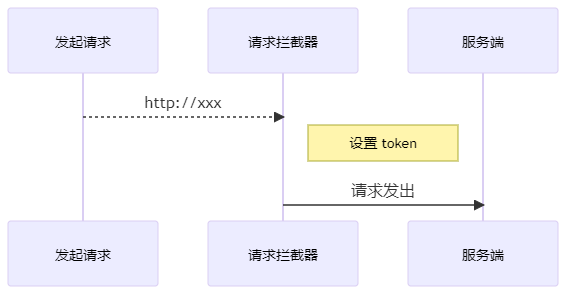

## **优化设置Token**

项目中的接口大部分需要我们提供token才有访问权限
通过接口文档我们可以看到，后端接口要求我们将token放到请求头header中并以下面的格式发送


>字段名称: Authorization
>字段值: Bearer token

方式一: 在每次请求的时候手动添加(麻烦)。

```javascript
axios({
    method: '',
    url: '',
    header: {
        Authorization: 'Bearer token'
    }
})
```

方式二：使用请求拦截器统一添加(推荐，更方便)



在 `src/utils/request.js` 中添加拦截器统一设置 token：

```javascript
/**
 * 请求模块
 */
import axios from 'axios'
import store from '@/store'

const request = axios.create({
    baseURL: 'http://toutiao.itheima.net' // 接口的基准地址
})

// 请求拦截器
request.interceptors.request.use(config => {
    // config: 本次请求的配置对象
    // config 里面有一个属性：header
    const { user } = store.state
    if(user && user.token) {
        config.header.Authorization = `Bearer ${user.token}`
    }
    return config
}, error => {
    return Promise.reject(error)
})

//响应拦截器

export default request
```
