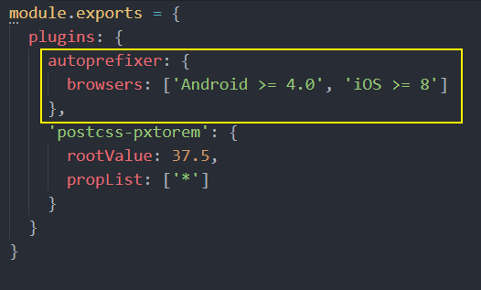

## **关于`.postcssrc.js`配置文件**

```javascript
module.exports = {
    plugin: {
        'autoprefixer': {
            browsers: ['Android >= 4.0', 'iOS >= 8']
        },
        'postcss-pxtorem': {
            rootValue: 37.5,
            propList: ['*']
        }
    }
}
```

`.postcssrc.js`是 PostCSS 的配置文件。

（1）PostCSS 介绍

[PostCSS](https://postcss.org/) 是一个处理 CSS 的处理工具，本身功能比较单一，它主要负责解析 CSS 代码，再交由插件来进行处理，它的插件体系非常强大，所能进行的操作是多种多样的，例如：

- [Autoprefixer](https://github.com/postcss/autoprefixer) 插件可以实现自动添加浏览器相关的声明前缀
- [PostCSS Preset Env](https://github.com/csstools/postcss-preset-env) 插件可以让你使用更新的CSS语法特性并实现向下兼容
- [postcss-pxtorem](https://github.com/cuth/postcss-pxtorem) 可以实现将 px 转换为 rem
- ...

目前 PostCSS 已经有 [200 多个功能各异的插件](https://github.com/postcss/postcss/blob/master/docs/plugins.md)。开发人员也可以根据项目的需要，开发出自己的 PostCSS 插件。

PostCSS 一般不单独使用，而是与已有的构建工具进行集成。

[Vue CLI 默认集成了 PostCSS](https://cli.vuejs.org/zh/guide/css.html#postcss)，并且默认开启了 [autoprefixer](https://github.com/postcss/autoprefixer) 插件。

>Vue CLI内部使用了PostCSS。
>你可以通过`.postcssrc`或任何 [postcss-load-config](https://github.com/michael-ciniawsky/postcss-load-config)支持的配置资源来配置PostCSS
>也可以通过vue.config.js中的css.loaderOptions.postcss配置 [postcss-loader](https://github.com/postcss/postcss-loader)。
>我们默认开启了[autoprefixer](https://github.com/postcss/autoprefixer)。如果要配置目标浏览器，可使用 `package.json` 的 [browserslist](https://cli.vuejs.org/zh/guide/browser-compatibility.html#browserslist) 字段。

（2）Autoprefixer 插件的配置



[autoprefixer](https://github.com/postcss/autoprefixer)是一个自动添加浏览器前缀的 PostCss 插件，`browsers` 用来配置兼容的浏览器版本信息，但是写在这里的话会引起编译器警告。

```error
Replace Autoprefixer browsers option to Browserslist config.
Use browserslist key in package.json or .browserslistrc file.

Using browsers option can cause errors. Browserslist config
can be used for Babel, Autoprefixer, postcss-normalize and other tools.

If you really need to use option, rename it to overrideBrowserslist.

Learn more at:
https://github.com/browserslist/browserslist#readme
https://twitter.com/browserslist
```

警告意思就是说你应该将 `browsers` 选项写到 `package.json` 或 `.browserlistrc` 文件中。

```default
[Android]
>= 4.0

[iOS]
>= 8
```

>具体语法请[参考这里](https://github.com/browserslist/browserslist)。
（3）postcss-pxtorem 插件的配置


- `rootValue`: 表示根元素字体大小，它会根据元素大小进行单位转换
- `propList`: 用来设定可以从px转为rem的属性
  - 例如`*`就是所有的属性都要转换，`width`就是仅仅转换`width`属性

`rootValue` 应该如何设置呢？

```default
如果你使用的是基于 lib-flexable 的 REM 适配方案，则应该设置为你的设计稿的十分之一。
例如设计稿是 750 宽，则应该设置为 75。
```

大多数设计稿的原型都是以 iphone6 为原型，iphone6 设备的宽是 750，我们的设计稿也是这样。

但是 Vant 建议设置为 37.5，为什么呢？

>因为 Vant 是基于 375 写的，所以如果你设置为 75 的话，Vant 的样式就小了一半。

所以如果设置为`37.5`的话，Vant 的样式是没有问题的，但是我们在测量设计稿的时候都必须除2才能使用，否则就会变得很大。

这样做其实也没有问题，但是有没有更好的办法呢？我就想实现测量多少写多少（不用换算）。于是聪明的你就想，可以不可以这样来做？

- 如果是 Vant 的样式，就把 `rootValue` 设置为 37.5 来转换
- 如果是我们的样式，就按照 75 的 `rootValue` 来转换

通过[查阅文档](https://github.com/cuth/postcss-pxtorem#options)我们可以看到 `rootValue` 支持两种参数类型：

- 数字：固定值
- 函数：动态计算返回
  - postcss-pxtorem处理每个 CSS 文件的时候都会来调用这个函数
  - 它会把被处理的 CSS 文件相关的信息通过参数传递给该函数

所以我们修改配置如下:

```javascript
/**
 * PostCSS配置文件
 */

module.exports - {
    // 配置要是用的PostCSS插件
    plugins: {
        // 配置使用 postcss-pxtorem 插件
        // 作用：把px 转为 rem
        'postcss-pxtorem': {
            rootValue ({ file }) {
                return file.indexOf('vant') !== -1 ? 37.5 : 75
            },
            propList: ['*']
        }
    }
}
```

配置完毕，把服务重启一下，最后测试，very good。
