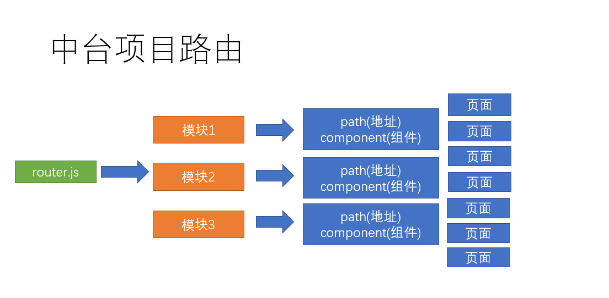

## **处理用户 Token**

`Token`是用户登录成功后服务端返回的一个身份令牌，在项目中的多个业务中需要使用到:

- 访问需要授权的API
- 校验页面的访问权限
- ...

但是我们只有在第一次用户登录成功之后才能拿到`Token`。
所以为了能在其它模块中获取到`Token`数据，我们需要把它存储到一个公共的位置，方便随时取用。
往哪儿存？

- 本地储存
  - 获取麻烦
  - 数据不是响应式
- Vuex容器（推荐）
  - 获取方便
  - 响应式的

使用容器存储`Token`的思路：



- 登录成功后，将`Token`存储到`Vuex`容器中
  - 获取方便
  - 响应式
- 为了持久化，还需要把`Token`存到本地储存
  - 持久化

下面是具体实现

1、在`src/store/index.js`中

```js
import Vue from 'vue'
import Vuex from 'vuex'

Vue.use(Vuex)

export default new Vuex.Store({
    state:{
        // 用户登录的状态信息
        user: JSON.parse(window.localStorage.getItem("TOUTIAO_USER"))
        // user: null
    },
    mutations: {
        setUser (state, user) {
            state.user = user
            window.localStorage.setItem('TOUTIAO_USER',JSON.stringify(user))
        }
    },
    action: {

    },
    modules: {

    }
})
```

2、登录成功以后将后端返回的 token 相关数据存储到容器中

```js
async onLogin () {
    this.$toast.loading({
        duration: 0, // 持续时间，0表示持续展示不停止
        forbidClick: true, // 是否禁止背景点击
        message: '登录中...' // 提示消息
    })

    try{
        const res = await login(this.user)
        this.$store.commit('setUser',res.data.data)
        this.$toast.success('登陆成功')
    } catch (err) {
        console.log('登录失败', err)
        this.$toast.fail('登录失败，手机号或验证码错误')
    }
    // 停止 loading，它会把当前页面中所有的 toast 都给清除
    // loginToast.clear()
}
```

## **优化封装本地存储操作模块**

创建`src/utils/storage.js`模块。

```js
export const getItem = name => {
    const data = window.localStorage.getItem(name)
    try{
        return JSON.parse(data)
    } catch (err) {
        return data
    }
}

export const setItem = (name, value) => {
    if(typeof value === 'object') {
        value = JSON.stringify(value)
    }
    window.localStorage.setItem('name',value)
}

export const removeItem = name => {
    window.localStorage.removeItem(name)
}
```

## **关于 Token 过期问题**

登录成功之后后端会返回两个 Token：

- `token`：访问令牌，有效期2小时
- `refresh_token`：刷新令牌，有效期14天，用于访问令牌过期之后重新获取新的访问令牌

我们的项目接口中设定的 `Token` 有效期是 `2 小时`，超过有效期服务端会返回 `401` 表示 Token 无效或过期了。

为什么过期时间这么短？

- 为了安全，例如 Token 被别人盗用

过期了怎么办？

- ~~让用户重新登录~~，用户体验太差了
- 使用`refresh-token`解决`token`过期

如何使用 `refresh_token` 解决 `token` 过期？

到课程的后面我们开发的业务功能丰富起来之后，再给大家讲解 Token 过期处理。

大家需要注意的是**在学习测试的时候如果收到 401 响应码，请重新登录再测试**。

概述：服务器生成`token`的过程中，会有两个时间，一个是`token`失效时间，一个是`token`刷新时间，刷新时间肯定比失效时间长，当用户的 `token` 过期时，你可以拿着过期的`token`去换取新的`token`，来保持用户的登陆状态，当然你这个过期`token`的过期时间必须在刷新时间之内，如果超出了刷新时间，那么返回的依旧是 401。

处理流程:

1. 在axios的拦截器中加入token刷新逻辑
2. 当用户token过期时，去向服务器请求新的 token
3. 把旧的token替换为新的token
4. 然后继续用户当前的请求

在请求的响应拦截器中统一处理 token 过期：

```js
/**
 * 封装 axios 请求模块
 */
import axios from "axios";
import jsonBig from "json-bigint";
import store from "@/store";
import router from "@/router";

// axios.create 方法：复制一个 axios
const request = axios.create({
  baseURL: "http://ttapi.research.itcast.cn/" // 基础路径
});

/**
 * 配置处理后端返回数据中超出 js 安全整数范围问题
 */
request.defaults.transformResponse = [
  function(data) {
    try {
      return jsonBig.parse(data);
    } catch (err) {
      return {};
    }
  }
];

// 请求拦截器
request.interceptors.request.use(
  function(config) {
    const user = store.state.user;
    if (user) {
      config.headers.Authorization = `Bearer ${user.token}`;
    }
    // Do something before request is sent
    return config;
  },
  function(error) {
    // Do something with request error
    return Promise.reject(error);
  }
);

// 响应拦截器
request.interceptors.response.use(
  // 响应成功进入第1个函数
  // 该函数的参数是响应对象
  function(response) {
    // Any status code that lie within the range of 2xx cause this function to trigger
    // Do something with response data
    return response;
  },
  // 响应失败进入第2个函数，该函数的参数是错误对象
  async function(error) {
    // Any status codes that falls outside the range of 2xx cause this function to trigger
    // Do something with response error
    // 如果响应码是 401 ，则请求获取新的 token

    // 响应拦截器中的 error 就是那个响应的错误对象
    console.dir(error);
    if (error.response && error.response.status === 401) {
      // 校验是否有 refresh_token
      const user = store.state.user;

      if (!user || !user.refresh_token) {
        router.push("/login");

        // 代码不要往后执行了
        return;
      }

      // 如果有refresh_token，则请求获取新的 token
      try {
        const res = await axios({
          method: "PUT",
          url: "http://ttapi.research.itcast.cn/app/v1_0/authorizations",
          headers: {
            Authorization: `Bearer ${user.refresh_token}`
          }
        });

        // 如果获取成功，则把新的 token 更新到容器中
        console.log("刷新 token  成功", res);
        store.commit("setUser", {
          token: res.data.data.token, // 最新获取的可用 token
          refresh_token: user.refresh_token // 还是原来的 refresh_token
        });

        // 把之前失败的用户请求继续发出去
        // config 是一个对象，其中包含本次失败请求相关的那些配置信息，例如 url、method 都有
        // return 把 request 的请求结果继续返回给发请求的具体位置
        return request(error.config);
      } catch (err) {
        // 如果获取失败，直接跳转 登录页
        console.log("请求刷线 token 失败", err);
        router.push("/login");
      }
    }

    return Promise.reject(error);
  }
);

export default request;
```
