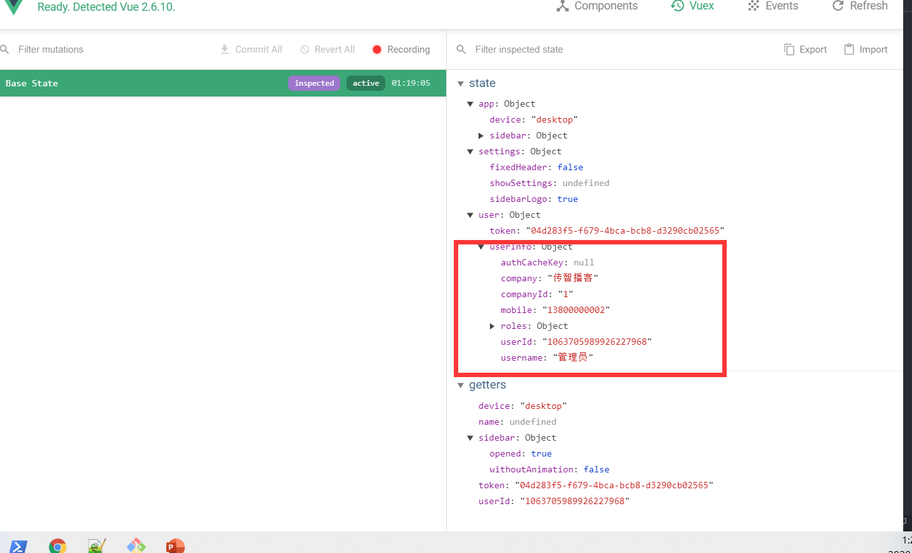

# 主页模块

## 主页的token拦截

### 权限拦截的流程图

>我们已经完成了登录的过程，并且存储了token，但是此时主页并没有因为token的有无而被控制访问权限

接下来我们需要实现以下如下的流程图


>在基础框架阶段，我们已经知道**`src/permission.js`**是专门处理路由权限的，所以我们在这里处理

### 流程图转化代码

**流程图转化的代码**.

```js
// 权限拦截 导航守卫 路由守卫  router
import router from '@/router' // 引入路由实例
import store from '@/store' // 引入vuex store实例
import NProgress from 'nprogress' // 引入一份进度条插件
import 'nprogress/nprogress.css' // 引入进度条样式

const whiteList = ['/login', '/404'] // 定义白名单  所有不受权限控制的页面
// 路由的前置守卫
router.beforeEach(function(to, from, next) {
  NProgress.start() // 开启进度条
  //  首先判断有无token
  if (store.getters.token) {
    //   如果有token 继续判断是不是去登录页
    if (to.path === '/login') {
      //  表示去的是登录页
      next('/') // 跳到主页
    } else {
      next() // 直接放行
    }
  } else {
    // 如果没有token
    if (whiteList.indexOf(to.path) > -1) {
      // 如果找到了 表示在在名单里面
      next()
    } else {
      next('/login') // 跳到登录页
    }
  }
  NProgress.done() // 手动强制关闭一次  为了解决 手动切换地址时  进度条的不关闭的问题
})
// 后置守卫
router.afterEach(function() {
  NProgress.done() // 关闭进度条
})

```

**

```js
// 权限拦截 导航守卫 路由守卫  router
import router from '@/router' // 引入路由实例
import store from '@/store' // 引入vuex store实例
import NProgress from 'nprogress' // 引入一份进度条插件
import 'nprogress/nprogress.css' // 引入进度条样式

const whiteList = ['/login', '/404'] // 定义白名单  所有不受权限控制的页面
// 路由的前置守卫
router.beforeEach(function(to, from, next) {
  NProgress.start() // 开启进度条
  //  首先判断有无token
  if (store.getters.token) {
    //   如果有token 继续判断是不是去登录页
    if (to.path === '/login') {
      //  表示去的是登录页
      next('/') // 跳到主页
    } else {
      next() // 直接放行
    }
  } else {
    // 如果没有token
    if (whiteList.indexOf(to.path) > -1) {
      // 如果找到了 表示在在名单里面
      next()
    } else {
      next('/login') // 跳到登录页
    }
  }
  NProgress.done() // 手动强制关闭一次  为了解决 手动切换地址时  进度条的不关闭的问题
})
// 后置守卫
router.afterEach(function() {
  NProgress.done() // 关闭进度条
})

```

> 在导航守卫的位置，我们添加了NProgress的插件，可以完成进入时的进度条效果

## 获取用户资料接口和token注入

**获取用户资料接口**.

在**`src/api/user.js`**中封装获取用户资料的方法

```js
/**
 *  获取用户的基本资料
 *
 * **/
export function getUserInfo() {
  return request({
    url: '/sys/profile',
    method: 'post'
  })
}
```

headers中的**Authorization**相当于我们**开门**（**调用接口**）时**`钥匙(token)`**，我们在打开任何带安全权限的门的时候都需要**`钥匙(token)`** 如图


每次在接口中携带**`钥匙（token）`**很麻烦，所以我们可以在axios拦截器中统一注入token


**统一注入token** **`src/utils/request.js`**

```js
service.interceptors.request.use(config => {
  // 在这个位置需要统一的去注入token
  if (store.getters.token) {
    // 如果token存在 注入token
    config.headers['Authorization'] = `Bearer ${store.getters.token}`
  }
  return config // 必须返回配置
}, error => {
  return Promise.reject(error)
}) 
```

## 封装获取用户资料的action并共享用户状态


**封装获取用户资料action**   **`action`**  **`src/store/modules/user.js`**

```js
import { login, getUserInfo } from '@/api/user'
  
  // 获取用户资料action
  async getUserInfo (context) {
    const result = await getUserInfo()  // 获取返回值
    context.commit('setUserInfo', result) // 将整个的个人信息设置到用户的vuex数据中
    return result // 这里为什么要返回 为后面埋下伏笔
  }
```

>同时，配套的我们还进行了关于用户状态的mutations方法的设计

**初始化state**  **`state`**

```js
const state = {
  token: getToken(), // 设置token初始状态   token持久化 => 放到缓存中
  userInfo: {} // 定义一个空的对象 不是null 因为后边我要开发userInfo的属性给别人用  userInfo.name
}
```

>userInfo为什么我们不设置为null，而是设置为 {}

因为我们会在**`getters`**中引用userinfo的变量，如果设置为null，则会引起异常和报错

**设置和删除用户资料**   **`mutations`**

```js
 // 设置用户信息
  setUserInfo(state, userInfo) {
    state.userInfo = { ...userInfo } // 用 浅拷贝的方式去赋值对象 因为这样数据更新之后，才会触发组件的更新
  },
  // 删除用户信息
  reomveUserInfo(state) {
    state.userInfo = {}
  }
```

>同学们，我们将所有的资料设置到了**userInfo**这个对象中，如果想要取其中一个值，我们还可以在getters中建立相应的映射

因为我们要做映射，如果初始值为null，一旦引用了getters，就会报错

**建立用户名的映射**  **`src/store/getters.js`**

```js
const getters = {
  sidebar: state => state.app.sidebar,
  device: state => state.app.device,
  token: state => state.user.token,
  name: state => state.user.userInfo.username // 建立用户名称的映射
}
export default getters
```

到现在为止，我们将用户资料的**action =>  mutation => state =>  getters** 都设置好了， 那么我们应该在什么位置来调用这个action呢 ？

## 权限拦截处调用获取资料action

## 权限拦截器调用action

用户资料有个硬性要求，**`必须有token`**才可以获取，那么我们就可以在确定有token的位置去获取用户资料


> 由上图可以看出，一旦确定我们进行了放行，就可以获取用户资料


**调用action** **`src/permission.js`**

```js
 if(!store.state.user.userInfo.userId) {
       await store.dispatch('user/getUserInfo')
 }
```

```js
  userId: state => state.user.userInfo.userId // 建立用户id的映射
```

代码就变成了

```js
 if (!store.getters.userId) {
        // 如果没有id这个值 才会调用 vuex的获取资料的action
        await store.dispatch('user/getUserInfo')
        // 为什么要写await 因为我们想获取完资料再去放行
      }
```

此时，我们可以通过dev-tools工具在控制台清楚的看到数据已经获取



## Token失效的主动介入

### 主动介入token处理的业务逻辑

> 开门的钥匙不是一直有效的，如果一直有效，会有安全风险，所以我们尝试在客户端进行一下token的时间检查

具体业务图如下


**流程图转化代码**.

**流程图转化代码** **`src/utils/auth.js`**

```js
const timeKey = 'hrsaas-timestamp-key' // 设置一个独一无二的key

// 获取时间戳
export function getTimeStamp() {
  return Cookies.get(timeKey)
}
// 设置时间戳
export function setTimeStamp() {
  Cookies.set(timeKey, Date.now())
}

```

`**

```js
const timeKey = 'hrsaas-timestamp-key' // 设置一个独一无二的key

// 获取时间戳
export function getTimeStamp() {
  return Cookies.get(timeKey)
}
// 设置时间戳
export function setTimeStamp() {
  Cookies.set(timeKey, Date.now())
}
```

**`src/utils/request.js`**

```js
import axios from 'axios'
import store from '@/store'
import router from '@/router'
import { Message } from 'element-ui'
import { getTimeStamp } from '@/utils/auth'
const TimeOut = 3600 // 定义超时时间

const service = axios.create({
// 当执行 npm run dev  => .evn.development => /api => 跨域代理
  baseURL: process.env.VUE_APP_BASE_API, // npm  run dev  => /api npm run build =>  /prod-api
  timeout: 5000 // 设置超时时间
})
// 请求拦截器
service.interceptors.request.use(config => {
  // config 是请求的配置信息
  // 注入token
  if (store.getters.token) {
    // 只有在有token的情况下 才有必要去检查时间戳是否超时
    if (IsCheckTimeOut()) {
      // 如果它为true表示 过期了
      // token没用了 因为超时了
      store.dispatch('user/logout') // 登出操作
      // 跳转到登录页
      router.push('/login')
      return Promise.reject(new Error('token超时了'))
    }
    config.headers['Authorization'] = `Bearer ${store.getters.token}`
  }
  return config // 必须要返回的
}, error => {
  return Promise.reject(error)
})
// 响应拦截器
service.interceptors.response.use(response => {
  // axios默认加了一层data
  const { success, message, data } = response.data
  //   要根据success的成功与否决定下面的操作
  if (success) {
    return data
  } else {
    // 业务已经错误了 还能进then ? 不能 ！ 应该进catch
    Message.error(message) // 提示错误消息
    return Promise.reject(new Error(message))
  }
}, error => {
  Message.error(error.message) // 提示错误信息
  return Promise.reject(error) // 返回执行错误 让当前的执行链跳出成功 直接进入 catch
})
// 是否超时
// 超时逻辑  (当前时间  - 缓存中的时间) 是否大于 时间差
function IsCheckTimeOut() {
  var currentTime = Date.now() // 当前时间戳
  var timeStamp = getTimeStamp() // 缓存时间戳
  return (currentTime - timeStamp) / 1000 > TimeOut
}
export default service
```

> 同理，在登录的时候，如果登录成功，我们应该设置时间戳

```js
  // 定义login action  也需要参数 调用action时 传递过来的参数
  // async 标记的函数其实就是一个异步函数 -> 本质是还是 一个promise
  async login(context, data) {
    // 经过响应拦截器的处理之后 这里的result实际上就是 token
    const result = await login(data) // 实际上就是一个promise  result就是执行的结果
    // axios默认给数据加了一层data
    // 表示登录接口调用成功 也就是意味着你的用户名和密码是正确的
    // 现在有用户token
    // actions 修改state 必须通过mutations
    context.commit('setToken', result)
    // 写入时间戳
    setTimeStamp() // 将当前的最新时间写入缓存
  }
```

## Token失效的被动处理

>除了token的主动介入之外，我们还可以对token进行被动的处理，如图


**代码实现**  **`src/utils/request.js`**

```js
error => {
  // error 信息 里面 response的对象
  if (error.response && error.response.data && error.response.data.code === 10002) {
    // 当等于10002的时候 表示 后端告诉我token超时了
    store.dispatch('user/logout') // 登出action 删除token
    router.push('/login')
  } else {
    Message.error(error.message) // 提示错误信息
  }
  return Promise.reject(error)
}
```
