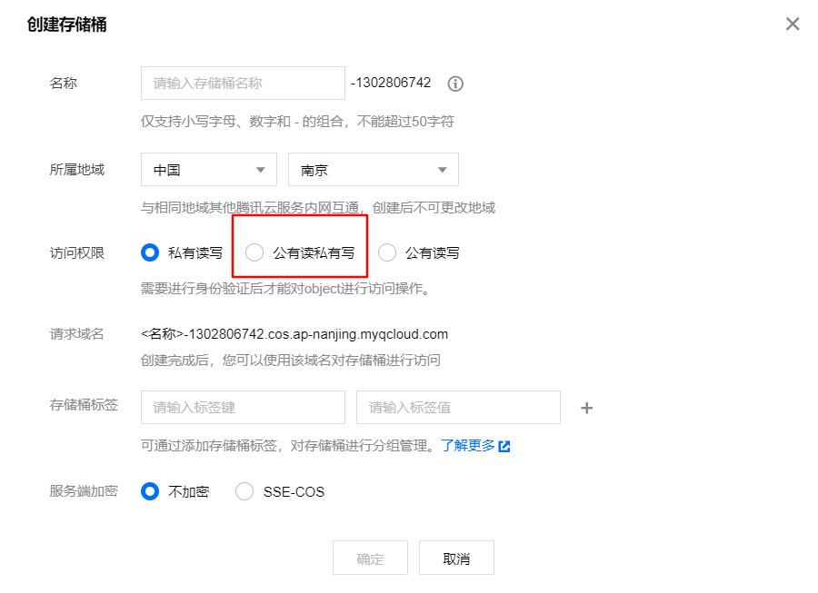
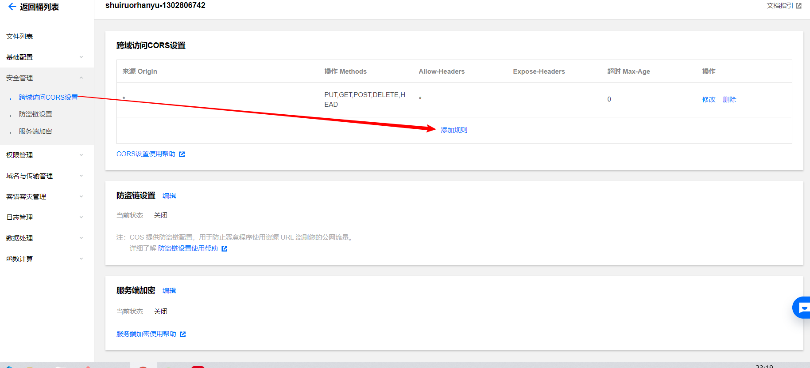
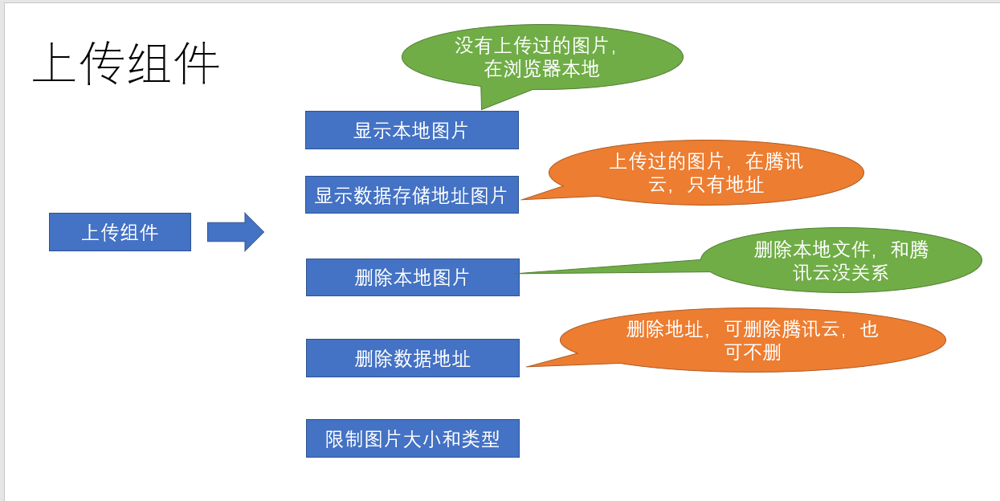
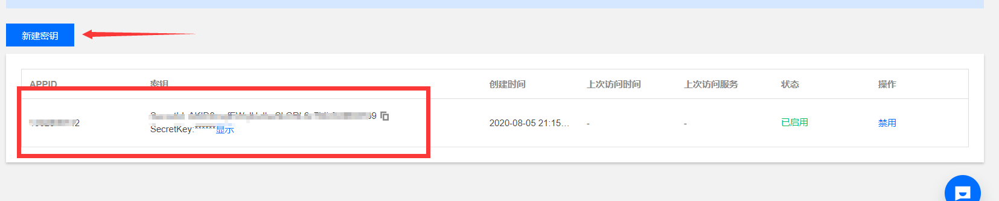

# 员工管理

## 通用工具栏的组件结构


在后续的业务开发中，经常会用到一个类似下图的工具栏，作为公共组件，进行一下封装

组件 **`src/components/PageTools/index.vue`**

```js
<template>
  <el-card class="page-tools">
    <el-row type="flex" justify="space-between" align="middle">
      <el-col>
        <div  v-if="showBefore" class="before">
          <i class="el-icon-info" />
          <!-- 定义前面得插槽 -->
          <slot name="before" />
        </div>
      </el-col>
      <el-col>
        <el-row type="flex" justify="end">
           <!-- 定义后面的插槽 -->
           <slot name="after" />
        </el-row>
      </el-col>
    </el-row>
  </el-card>
</template>

<script>
export default {
  props: {
    showBefore: {
      type: Boolean,
      default: false
    }

  }
}
</script>

<style lang='scss'>
 .page-tools {
    margin: 10px 0;
    .before {
      line-height: 34px;
    i {
      margin-right: 5px;
      color: #409eff;
    }
    display: inline-block;
    padding: 0px 10px;
    border-radius: 3px;
    border: 1px solid rgba(145, 213, 255, 1);
    background: rgba(230, 247, 255, 1);
  }
 }
</style>

```

## 组件统一注册

> 为了方便所有的页面都可以不用引用该组件，可以进行全局注册

提供注册入口 **`src/componets/index.js`**

// 该文件负责所有的公共的组件的全局注册   Vue.use
import PageTools from './PageTools'
export default {
  install(Vue) {
    //  注册全局的通用栏组件对象
    Vue.component('PageTools', PageTools)
  }
}

> 在入口处进行注册 **`src/main.js`**

```js
import Component from '@/components'
Vue.use(Component) // 注册自己的插件
```

## 员工导入组件封装

**`目标`**：封装一个导入excel数据的文件

首先封装一个类似的组件，首先需要注意的是，类似功能，vue-element-admin已经提供了，我们只需要改造即可 [代码地址](https://github.com/PanJiaChen/vue-element-admin/blob/master/src/components/UploadExcel/index.vue)

excel导入功能需要使用npm包**`xlsx`**，所以需要安装**`xlsx`**插件

```bash
$npm i xlsx
```

>将vue-element-admin提供的导入功能新建一个组件，位置： **`src/components/UploadExcel`**

**注册全局的导入excel组件**.

```js
import PageTools from './PageTools'
import UploadExcel from './UploadExcel'
export default{
    install(Vue){
        Vue.component('PageTools',PageTools) // 注册工具栏组件
        Vue.component('UploadExcel',UploadExcel) // 注册导入Excel组件
    }
}
```

**修改样式和布局**.

```html
<template>
 <div class="upload-excel">
    <div class="btn-upload">
      <el-button :loading="loading" size="mini" type="primary" @click="handleUpload">
        点击上传
      </el-button>
    </div>

    <input ref="excel-upload-input" class="excel-upload-input" type="file" accept=".xlsx, .xls" @change="handleClick">
    <div class="drop" @drop="handleDrop" @dragover="handleDragover" @dragenter="handleDragover">
      <i class="el-icon-upload" />
      <span>将文件拖到此处</span>
    </div>
  </div>
</template>
<style scoped lang="scss">
.upload-excel {
  display: flex;
  justify-content: center;
   margin-top: 100px;
   .excel-upload-input{
       display: none;
        z-index: -9999;
     }
   .btn-upload , .drop{
      border: 1px dashed #bbb;
      width: 350px;
      height: 160px;
      text-align: center;
      line-height: 160px;
   }
   .drop{
       line-height: 80px;
       color: #bbb;
      i {
        font-size: 60px;
        display: block;
      }
   }
}
</style>
```

## 员工的导入

### 建立公共导入的页面路由

**新建一个公共的导入页面，挂载路由** **`src/router/index.js`**

```js
{
    path: '/import',
    component: Layout,
    hidden: true, // 隐藏在左侧菜单
    children: [{
        path: '', // 二级路由path什么都不写 表示二级默认路由
        component: () => import('@/views/import')
    }]
}
```

**创建import路由组件** **`src/views/import/index.vue`**

```js
<template>
  <!-- 公共导入组件 --> 
  <upload-excel :on-success="success" />
</template>
```

**获取导入的excel数据, 导入excel接口**.

```js
async  success({ header, results }) {
      // 如果是导入员工
        const userRelations = {
          '入职日期': 'timeOfEntry',
          '手机号': 'mobile',
          '姓名': 'username',
          '转正日期': 'correctionTime',
          '工号': 'workNumber'
        }
        const arr = []
       results.forEach(item => {
          const userInfo = {}
          Object.keys(item).forEach(key => {
            userInfo[userRelations[key]] = item[key]
          })
         arr.push(userInfo) 
        })
        await importEmployee(arr) // 调用导入接口
        this.$router.back()
    }
```

> 为了让这个页面可以服务更多的导入功能，我们可以在页面中用参数来判断，是否是导入员工

```js
 data() {
    return {
      type: this.$route.query.type
    }
  },
```

当excel中有日期格式的时候，实际转化的值为一个数字，我们需要一个方法进行转化

```js
formatDate(numb, format) {
      const time = new Date((numb - 1) * 24 * 3600000 + 1)
      time.setYear(time.getFullYear() - 70)
      const year = time.getFullYear() + ''
      const month = time.getMonth() + 1 + ''
      const date = time.getDate() - 1 + ''
      if (format && format.length === 1) {
        return year + format + month + format + date
      }
      return year + (month < 10 ? '0' + month : month) + (date < 10 ? '0' + date : date)
    }
```

**逻辑判断** .

```js
async  success({ header, results }) {
      if (this.type === 'user') {
        const userRelations = {
          '入职日期': 'timeOfEntry',
          '手机号': 'mobile',
          '姓名': 'username',
          '转正日期': 'correctionTime',
          '工号': 'workNumber'
        }
        const arr = []
        // 遍历所有的数组
        results.forEach(item => {
        // 需要将每一个条数据里面的中文都换成英文
          const userInfo = {}
          Object.keys(item).forEach(key => {
          // key是当前的中文名 找到对应的英文名
            if (userRelations[key] === 'timeOfEntry' || userRelations[key] === 'correctionTime') {
              userInfo[userRelations[key]] = new Date(this.formatDate(item[key], '/')) // 只有这样, 才能入库
              return
            }
            userInfo[userRelations[key]] = item[key]
          })
          // 最终userInfo变成了全是英文
          arr.push(userInfo)
        })
        await importEmployee(arr)
        this.$message.success('导入成功')
      }
      this.$router.back() // 回到上一页
    },
    formatDate(numb, format) {
      const time = new Date((numb - 1) * 24 * 3600000 + 1)
      time.setYear(time.getFullYear() - 70)
      const year = time.getFullYear() + ''
      const month = time.getMonth() + 1 + ''
      const date = time.getDate() - 1 + ''
      if (format && format.length === 1) {
        return year + format + month + format + date
      }
      return year + (month < 10 ? '0' + month : month) + (date < 10 ? '0' + date : date)
    }
```

## 员工导出excel功能

**目标**： 实现将员工数据导出功能

Excel 的导入导出都是依赖于[js-xlsx](https://github.com/SheetJS/js-xlsx)来实现的。

在 `js-xlsx`的基础上又封装了[Export2Excel.js](https://github.com/PanJiaChen/vue-element-admin/blob/master/src/vendor/Export2Excel.js)来方便导出数据。

由于 `Export2Excel`不仅依赖`js-xlsx`还依赖`file-saver`和`script-loader`。

所以你先需要安装如下命令：

```bash
npm install xlsx file-saver -S
npm install script-loader -S -D
```

由于`js-xlsx`体积还是很大的，导出功能也不是一个非常常用的功能，所以使用的时候建议使用懒加载。使用方法如下：

```js
import('@/vendor/Export2Excel').then(excel => {
  excel.export_json_to_excel({
    header: tHeader, //表头 必填
    data, //具体数据 必填
    filename: 'excel-list', //非必填
    autoWidth: true, //非必填
    bookType: 'xlsx' //非必填
  })
})
```

因为数据中的key是英文，想要导出的表头是中文的话，需要将中文和英文做对应

```js
   const headers = {
        '手机号': 'mobile',
        '姓名': 'username',
        '入职日期': 'timeOfEntry',
        '聘用形式': 'formOfEmployment',
        '转正日期': 'correctionTime',
        '工号': 'workNumber',
        '部门': 'departmentName'
      }
```

然后，**完成导出代码**

```js
// 导出excel数据
    exportData() {
      //  做操作
      // 表头对应关系
      const headers = {
        '姓名': 'username',
        '手机号': 'mobile',
        '入职日期': 'timeOfEntry',
        '聘用形式': 'formOfEmployment',
        '转正日期': 'correctionTime',
        '工号': 'workNumber',
        '部门': 'departmentName'
      }
      // 懒加载
      import('@/vendor/Export2Excel').then(async excel => {
        const { rows } = await getEmployeeList({ page: 1, size: this.page.total })
        const data = this.formatJson(headers, rows)

        excel.export_json_to_excel({
          header: Object.keys(headers),
          data,
          filename: '员工信息表',
          autoWidth: true,
          bookType: 'xlsx'

        })
        // 获取所有的数据

        // excel.export_json_to_excel({
        //   header: ['姓名', '薪资'],
        //   data: [['张三', 12000], ['李四', 5000]],
        //   filename: '员工薪资表',
        //   autoWidth: true,
        //   bookType: 'csv'
        // })
      })
    },
    // 该方法负责将数组转化成二维数组
    formatJson(headers, rows) {
      // 首先遍历数组
      // [{ username: '张三'},{},{}]  => [[’张三'],[],[]]
      return rows.map(item => {
        return Object.keys(headers).map(key => {
          if (headers[key] === 'timeOfEntry' || headers[key] === 'correctionTime') {
            return formatDate(item[headers[key]]) // 返回格式化之前的时间
          } else if (headers[key] === 'formOfEmployment') {
            var en = EmployeeEnum.hireType.find(obj => obj.id === item[headers[key]])
            return en ? en.value : '未知'
          }
          return item[headers[key]]
        }) // => ["张三", "13811"，"2018","1", "2018", "10002"]
      })
      // return data
      // return rows.map(item => {
      //   // item是对象  => 转化成只有值的数组 => 数组值的顺序依赖headers  {username: '张三'  }
      //   // Object.keys(headers)  => ["姓名", "手机号",...]
      //   return Object.keys(headers).map(key => {
      //     return item[headers[key]]
      //   }) // /  得到 ['张三'，’129‘，’dd‘,'dd']
      // })
    }
```

### 复杂表头的导出

> 当需要导出复杂表头的时候，vue-element-admin同样支持该类操作

**vue-element-admin** 提供的导出方法中有 **multiHeader**和**merges** 的参数

multiHeader里面是一个二维数组，里面的一个元素是一行表头，假设你想得到一个如图的结构


mutiHeader应该这样定义

```js
const multiHeader = [['姓名', '主要信息', '', '', '', '', '部门']]
```

multiHeader中的一行表头中的字段的个数需要和真正的列数相等，假设想要跨列，多余的空间需要定义成空串

它主要对应的是标准的表头

```js
const header = ['姓名', '手机号', '入职日期', '聘用形式', '转正日期', '工号', '部门']

```

如果，我们要实现其合并的效果， 需要设定merges选项

```js
 const merges = ['A1:A2', 'B1:F1', 'G1:G2']
```

merges的顺序是没关系的，只要配置这两个属性，就可以导出复杂表头的excel了

```js
exportData() {
      const headers = {
        '姓名': 'username',
        '手机号': 'mobile',
        '入职日期': 'timeOfEntry',
        '聘用形式': 'formOfEmployment',
        '转正日期': 'correctionTime',
        '工号': 'workNumber',
        '部门': 'departmentName'
      }
      // 导出excel
      import('@/vendor/Export2Excel').then(async excel => {
        //  excel是引入文件的导出对象
        // 导出  header从哪里来
        // data从哪里来
        // 现在没有一个接口获取所有的数据
        // 获取员工的接口 页码 每页条数    100   1 10000
        const { rows } = await getEmployeeList({ page: 1, size: this.page.total })
        const data = this.formatJson(headers, rows) // 返回的data就是 要导出的结构
        const multiHeader = [['姓名', '主要信息', '', '', '', '', '部门']]
        const merges = ['A1:A2', 'B1:F1', 'G1:G2']
        excel.export_json_to_excel({
          header: Object.keys(headers),
          data,
          filename: '员工资料表',
          multiHeader, // 复杂表头
          merges // 合并选项
        })

        // excel.export_json_to_excel({
        //   header: ['姓名', '工资'],
        //   data: [['张三', 3000], ['李四', 5000]],
        //   filename: '员工工资表'
        // })
        // [{ username: '张三',mobile: 13112345678 }]  => [[]]
        // 要转化 数据结构 还要和表头的顺序对应上
        // 要求转出的标题是中文
      })
    },
    // 将表头数据和数据进行对应
    // [{}]  =>   [[]]
    formatJson(headers, rows) {
      return rows.map(item => {
        // item是一个对象  { mobile: 132111,username: '张三'  }
        // ["手机号", "姓名", "入职日期" 。。]
        return Object.keys(headers).map(key => {
          // 需要判断 字段
          if (headers[key] === 'timeOfEntry' || headers[key] === 'correctionTime') {
            // 格式化日期
            return formatDate(item[headers[key]])
          } else if (headers[key] === 'formOfEmployment') {
            const obj = EmployeeEnum.hireType.find(obj => obj.id === item[headers[key]])
            return obj ? obj.value : '未知'
          }
          return item[headers[key]]
        })
        // ["132", '张三’， ‘’，‘’，‘’d]
      })
      // return rows.map(item => Object.keys(headers).map(key => item[headers[key]]))
      // 需要处理时间格式问题
    }
```

## 更改头像

由于该项目为课上项目的特殊性，项目官方不希望把所有头像图片都上传到他们的服务器上，这里我们采用一个腾讯云的图片方案


>上边图的意思就是说，我们找一个可以免费上传图片的服务器，帮我们**`代管图片`**，我们在自己的数据库里只保存一个地址就行， 这其实也是很多项目的处理方案，会有一个**`公共的文件服务器`**

接下来，我们需要来创建一个存储图片的存储桶

登录 [对象存储控制台](https://console.cloud.tencent.com/cos5) ，[创建存储桶](https://cloud.tencent.com/document/product/436/13309)。设置存储桶的权限为 **`公有读，私有写`**







>因为我们本身没有域名，所以这里设置成**`*`**，仅限于测试，正式环境的话，这里需要配置真实的域名地址

## 封装上传图片组件-上传组件需求分析

**初始化cos对象参数**.

| 名称      | 描述                                                         |
| :-------- | :----------------------------------------------------------- |
| SecretId  | 开发者拥有的项目身份识别 ID，用以身份认证，可在 [API 密钥管理](https://console.cloud.tencent.com/capi) 页面获取 |
| SecretKey | 开发者拥有的项目身份密钥，可在 [API 密钥管理](https://console.cloud.tencent.com/capi) 页面获取 |

>注意，上述的参数我们在本次开发过程中，直接将参数放置在前端代码中存储，但是腾讯云本身是不建议这么做的，因为**`敏感信息`**放在前端很容易被捕获，由于我们本次是测试研发，所以这个过程可以忽略
>正确的做法应该是，通过网站调用接口换取敏感信息

[相关文档](https://cloud.tencent.com/document/product/436/11459)

实例化 上传sdk

```js
var cos = new COS({
    SecretId: 'COS_SECRETID', // 身份识别 ID
    SecretKey: 'COS_SECRETKEY', // 身份密钥
});
```



**安装JavaScript SDK**.

```bash
$npm i cos-js-sdk-v5 --save
```

### 点击图片进行预览

**限定上传的图片数量和action**.

```html
<template>
  <el-upload list-type="picture-card" :limit="1" action="#">
  </el-upload>
</template>
```

>action为什么给#， 因为前面我们讲过了，我们要上传到腾讯云，需要自定义的上传方式,action给个#防止报错

**预览**.

```js
data() {
    return {
      fileList: [], // 图片地址设置为数组 
      showDialog: false, // 控制显示弹层
      imgUrl: ''
    }
  },
```

```js
     preview(file) {
      // 这里应该弹出一个层 层里是点击的图片地址
      this.imgUrl = file.url
      this.showDialog = true
  },  
```

**预览弹层**.

```js
  <el-dialog title="图片" :visible.sync="showDialog">
      
   </el-dialog>
```

### 根据上传数量控制上传按钮

**控制上传显示**.

```js
 computed: {
    // 设定一个计算属性 判断是否已经上传完了一张
    fileComputed() {
      return this.fileList.length === 1
    }
  },
```

```html
 <el-upload
      :on-preview="preview"
      :on-remove="handleRemove"
      :on-change="changeFile"
      :file-list="fileList"
      list-type="picture-card"
      action="#"
      :limit="1"
      :class="{disabled: fileComputed }"
    >

<style>
.disabled .el-upload--picture-card {
  display: none
}
</style>

```

### 删除图片和添加图片

**删除文件**.

```js
  handleRemove(file) {
    // file是点击删除的文件
  //   将原来的文件给排除掉了 剩下的就是最新的数组了
    this.fileList = this.fileList.filter(item => item.uid !== file.uid)
  },
```

**添加文件**.

```js
  // 修改文件时触发
  // 此时可以用fileList 因为该方法会进来很多遍 不能每次都去push
  // fileList因为fileList参数是当前传进来的最新参数 我们只需要将其转化成数组即可 需要转化成一个新的数组
  // [] => [...fileList] [] => fileList.map()
  // 上传成功之后 还会进来 需要实现上传代码的逻辑 这里才会成功
  changeFile(file, fileList) {
    this.fileList = fileList.map(item => item)
  }
```

### 上传之前检查

>控制上传图片的类型和上传大小， 如果不满足条件 返回false上传就会停止

```js
  beforeUpload(file) {
    // 要开始做文件上传的检查了
    // 文件类型 文件大小
    const types = ['image/jpeg', 'image/gif', 'image/bmp', 'image/png']
    if (!types.includes(file.type)) {
      this.$message.error('上传图片只能是 JPG、GIF、BMP、PNG 格式!')
      return false
    }
    //  检查大小
    const maxSize = 5 * 1024 * 1024
    if (maxSize < file.size) {
      this.$message.error('图片大小最大不能超过5M')
      return false
    }
    return true
  }
```

### 上传动作调用上传腾讯云

**上传动作为el-upload的http-request属性**.

```js
 :http-request="upload"

  // 自定义上传动作 有个参数 有个file对象，是我们需要上传到腾讯云服务器的内容
  upload(params) {
    console.log(params.file)
  } 
```

> 我们需要在该方法中，调用腾讯云的上传方法

[腾讯云文档地址](https://cloud.tencent.com/document/product/436/35649#.E7.AE.80.E5.8D.95.E4.B8.8A.E4.BC.A0.E5.AF.B9.E8.B1.A1)

身份ID和密钥可以通过腾讯云平台获取

登录 [访问管理控制台](https://console.cloud.tencent.com/capi) ，获取您的项目 SecretId 和 SecretKey。



实现代码

```js
// 进行上传操作
  upload(params) {
  //   console.log(params.file)
    if (params.file) {
      // 执行上传操作
      cos.putObject({
        Bucket: 'shuiruohanyu-106-1302806742', // 存储桶
        Region: 'ap-beijing', // 地域
        Key: params.file.name, // 文件名
        Body: params.file, // 要上传的文件对象
        StorageClass: 'STANDARD' // 上传的模式类型 直接默认 标准模式即可
        // 上传到腾讯云 =》 哪个存储桶 哪个地域的存储桶 文件  格式  名称 回调
      }, function(err, data) {
        // data返回数据之后 应该如何处理
        console.log(err || data)
      })
    }
  }
```

### 上传成功之后处理返回数据

确定要上传记录id

```js
beforeUpload(file) {
    //   先检查文件类型
    const types = ['image/jpeg', 'image/gif', 'image/bmp', 'image/png']
    if (!types.some(item => item === file.type)) {
      //   如果不存在
      this.$message.error('上传图片只能是 JPG、GIF、BMP、PNG 格式!')
      return false // 上传终止
    }
    // 检查文件大小  5M 1M = 1024KB 1KB = 1024B
    const maxSize = 5 * 1024 * 1024
    if (file.size > maxSize) {
      //   超过了限制的文件大小
      this.$message.error('上传的图片大小不能大于5M')
      return false
    }
    //   已经确定当前上传的就是当前的这个file了
    this.currentFileUid = file.uid
    return true // 最后一定要return  true
},
```

> 处理返回数据

```js
  // 进行上传操作
  upload(params) {
  //   console.log(params.file)
    if (params.file) {
      // 执行上传操作
      cos.putObject({
        Bucket: 'shuiruohanyu-106-1302806742', // 存储桶
        Region: 'ap-beijing', // 地域
        Key: params.file.name, // 文件名
        Body: params.file, // 要上传的文件对象
        StorageClass: 'STANDARD' // 上传的模式类型 直接默认 标准模式即可
        // 上传到腾讯云 =》 哪个存储桶 哪个地域的存储桶 文件  格式  名称 回调
      }, (err, data) => {
        // data返回数据之后 应该如何处理
        console.log(err || data)
        // data中有一个statusCode === 200 的时候说明上传成功
        if (!err && data.statusCode === 200) {
          //   此时说明文件上传成功  要获取成功的返回地址
          // fileList才能显示到上传组件上 此时我们要将fileList中的数据的url地址变成 现在上传成功的地址
          // 目前虽然是一张图片 但是请注意 我们的fileList是一个数组
          // 需要知道当前上传成功的是哪一张图片
          this.fileList = this.fileList.map(item => {
            // 去找谁的uid等于刚刚记录下来的id
            if (item.uid === this.currentFileUid) {
              // 将成功的地址赋值给原来的url属性
              return { url: 'http://' + data.Location, upload: true }
              // upload 为true 表示这张图片已经上传完毕 这个属性要为我们后期应用的时候做标记
              // 保存  => 图片有大有小 => 上传速度有快又慢 =>要根据有没有upload这个标记来决定是否去保存
            }
            return item
          })
          // 将上传成功的地址 回写到了fileList中 fileList变化  =》 upload组件 就会根据fileList的变化而去渲染视图
        }
      })
    }
  }
```

>我们在fileList中设置了属性为upload为true的属性，表示该图片已经上传成功了，如果fileList还有upload不为true的数据，那就表示该图片还没有上传完毕

## 利用vue-print-nb进行打印

首先，打印功能我们借助一个比较流行的插件

```bash
$npm i vue-print-nb
```

使用v-print指令的方式进行打印

```html
<el-row type="flex" justify="end">
        <el-button v-print="printObj" size="small" type="primary">打印</el-button>
</el-row>

  printObj: {
      id: 'myPrint'
  }
```
