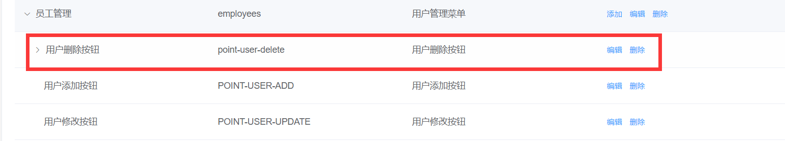

# 权限设计与管理

## 权限设计-RBAC的权限设计思想

> 首先，我们先了解下什么是传统的权限设计


从上面的图中，我们发现，传统的权限设计是对每个人进行单独的权限设置，但这种方式已经不适合目前企业的高效管控权限的发展需求，因为每个人都要单独去设置权限

> 基于此，RBAC的权限模型就应运而生了，RBAC(Role-Based Access control) ，也就是基于角色的权限分配解决方案，相对于传统方案，RBAC提供了中间层Role（角色），其权限模式如下


RBAC实现了用户和权限点的分离，想对某个用户设置权限，只需要对该用户设置相应的角色即可，而该角色就拥有了对应的权限，这样一来，权限的分配和设计就做到了极简，高效，当想对用户收回权限时，只需要收回角色即可，接下来，我们就在该项目中实施这一设想

## 给分配员工角色

### 新建分配角色窗体

首先，新建分配角色窗体 **`assign-role.vue`**


### 获取角色列表和当前用户角色

### 给员工分配角色

## 权限点管理页面开发

### 新建权限点管理页面

> API权限多见于在后端进行拦截，这里只做了页面访问和按钮操作授权


## 前端权限应用-页面访问和菜单

### 权限受控的主体思路

在上面，已经把给用户分配了角色， 给角色分配了权限，那么在用户登录获取资料的时候，会自动查出该用户拥有哪些权限，这个权限需要和我们的菜单还有路由有效结合起来


在权限管理页面，每个模块都以一个如上图的**标识**,这个标识可以和我们的路由模块相关联，用户有这个标识就可以访问对应路由，没有就不能访问

vue-router提供了一个叫做[addRoutes](https://router.vuejs.org/zh/api/#router-addroutes)的API方法，这个方法的含义是**动态添加路由规则**


### 新建Vuex中管理权限的模块

**`src/store/modules/permission.js`**

```js
// vuex的权限模块
import { constantRouters } from '@/router'
// vuex中的permission用于存放静态路由+当前用户拥有的动态路由
const state = {
    routes: constantRoutes
}
const mutation = {
    // newRoutes为用户通关权限获取的动态路由
    setRoutes(state, newRoutes) {
        // 下面这种写法是不对的
        // state.routes = [ ...state.route, ...newRoutes ]
        // 应该在静态路由的基础上加上动态路由
        state.routes = [ ...constantRoutes, ...newRoutes ]
        // 否则会出现如
        // 张三有2个动态路由，李四有两个和张三不一样的动态路由
        // 张三登录了有2个动态路由李四登陆会在张三的基础上再加张三的路由，就是4个动态路由
        // 但李四只有2个动态路由，造成了错误
    }
    }
    const actions = {}
    export default {
    namespaced: true,
    state,
    mutations,
    actions
    }
}
```

在Vuex管理模块中引入permisson模块

```js
import permission from './modules/permission'
const store = new Vuex.Store({
  modules: {
    // 子模块   $store.state.app.
    // mapGetters([])
    app,
    settings,
    user,
    permission
  },
  getters
})
```

### Vuex筛选权限路由


我们可以在这张图中，进一步的进行操作


> 可以将路由模块的根节点**`name`**属性命名和权限标识一致，这样只要标识能对上，就说明用户拥有了该权限

接下来， vuex的permission中提供一个action，进行关联

```js
import { asyncRoutes, constantRoutes } from '@/router'

const action = {
    // 筛选权限路由
    // 第二个参数为当前用户的所拥有的菜单权限
    // menus: ["settings","permissions"]
    // asyncRoutes是所有的动态路由
    // asyncRoutes  [{path: 'setting',name: 'setting'},{}]
    filterRoutes(context, menus) {
        const routes = []
        //   筛选出 动态路由中和menus中能够对上的路由   
        menus.forEach(key => {
            routes.push(...asyncRoutes.filter(item => item.name === key))
        })
        context.commit('setRoutes', routes)
        return routes
    }
}
```

### 在权限拦截处调用action筛选权限路由

在路由模块的路由前置守卫处调用路由权限筛选，获取新的routes，并且addRoutes

```js
import router from '@/router'
import store from '@/store' // 引入store实例 和组件中的this.$store是一回事
import nprogress from 'nprogress' // 引入进度条

const whiteList = ['/login', '/404'] // 定义白名单

router.beforeEach(async(to, from, next) => {
    if(store.getters.token) {
        // 如果有token证明已经登录
        if(to.path === '/login'){
            // 有token去访问登录页，自动跳转到首页
            next('/')
        } else {
            if(!store.getters.userId) {
                // 没有用户id，证明用户资料还没有获取
                const { roles } = await store.dispatch('user/getUserInfo')
                // actions中函数 默认是Promise对象 调用这个对象 想要获取返回的值话 必须 加 await或者是then
                // actions是做异步操作的
                const routes = await store.dispatch('permission/filterRoutes',roles.menus)
                // routes为筛选得到的动态路由
                // 动态路由 添加到 路由表中 默认的路由表 只有静态路由 没有动态路由
                // addRoutes  必须 用 next(地址) 不能用next()
                router.addRoutes(routes) // 添加动态路由到路由表  铺路
                next(to.path)
            } else {
                next()
            }
        }
    } else {
        // 没有token的情况下
        if(whiteList.indexOf(to.path) > -1) {
            next()
        } else {
            next('/login')
        }
    }
})
```

在**`src/store/getters.js`**配置导出routes

```js
const getters = {
  sidebar: state => state.app.sidebar,
  device: state => state.app.device,
  token: state => state.user.token,
  name: state => state.user.userInfo.username, // 建立用户名称的映射
  userId: state => state.user.userInfo.userId, // 建立用户id的映射
  companyId: state => state.user.userInfo.companyId, // 建立用户的公司Id映射
  routes: state => state.permission.routes // 导出当前的路由
}
export default getters
```

在左侧菜单组件中引入routes

```js
computed: {
    ...mapGetters([
    'sidebar', 'routes'
]),
```

## 登出时，重置路由权限和 404问题

>前面在**addRoutes**的时候，一直都是在**加**，登出的时候，我们并没有删，也没有重置，也就是说，我们之前加的路由在登出之后一直在，这怎么处理？

**router/index.js**文件，发现一个重置路由方法

```js
// 重置路由
export function resetRouter() {
  const newRouter = createRouter()
  router.matcher = newRouter.matcher // 重新设置路由的可匹配路径
}
```

这个方法就是将路由重新实例化，相当于换了一个新的路由，之前**`加的路由`**自然不存在了，只需要在登出的时候， 处理一下即可

```js
// 登出的action
logout() {
    // 删除token
    context.commit('removeToken') 
    // 删除用户资料
    context.commit('removeUserInfo')
    // 重置路由
    resetRouter()
    // 还有一步  vuex中的数据是不是还在
    // 要清空permission模块下的state数据
    // vuex中 user子模块  permission子模块
    // 子模块调用子模块的action  默认情况下 子模块的context是子模块的
    // 父模块 调用 子模块的action
    context.commit('permission/setRoutes', [], { root: true })
    // 子模块调用子模块的action 可以 将 commit的第三个参数 设置成  { root: true } 就表示当前的context不是子模块了 而是父模块
}

```

除此之外，在页面刷新的时候，本来应该拥有权限的页面出现了404，这是因为404的匹配权限放在了静态路由，而动态路由在没有addRoutes之前，找不到对应的地址，就会显示404，所以我们需要将404放置到动态路由的最后

**`src/permission.js`**.

```js
router.addRoutes([...routes, { path: '*', redirect: '/404', hidden: true }]) // 添加到路由表
```

## 功能权限应用

功能权限的受控思路

>一个页面的访问权限之后，页面中的某些功能，用户可能有，也可能没有，这就是功能权限

查询出来的数据中的**`points`**

首先需要在员工管理的权限点下， 新增一个删除权限点，启用



>要做的就是看看用户，是否拥有**point-user-delete**这个point，有就可以让删除能用，没有就隐藏或者禁用

### 使用Mixin技术将检查方法注入

所以，可以采用一个新的技术 [mixin(混入)](https://cn.vuejs.org/v2/guide/mixins.html)来让所有的组件可以拥有一个公共的方法

**`src/mixin/checkPermission.js`**

```js
import store from '@/store'
export default {
    methods: {
        checkPermission(key) {
            const { userInfo } = store.state.user
            if(userInfo.roles.points && userInfo.roles.points.length){
                return userInfo.roles.points.some(item => item === key)
            }
            return false
        }
    }
}
```

并且在全局注册

**在`main.js`中**

```js
import checkPermission from '@/mixin/checkPermission'
Vue.mixin(checkPermission)
```

**在员工组件中检查权限点**.

```html
 <el-button :disabled="!checkPermission('POINT-USER-UPDATE')" type="text" size="small" @click="$router.push(`/employees/detail/${obj.row.id}`)">查看</el-button>
```

此时，可以通过配置权限的方式，检查权限的可用性了
