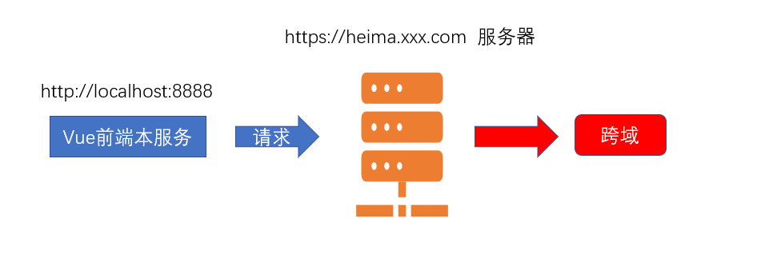
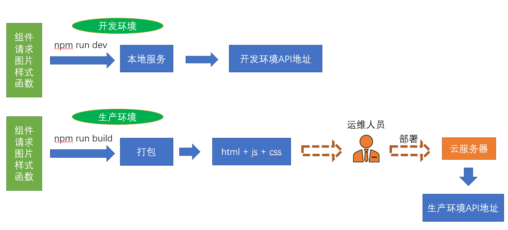
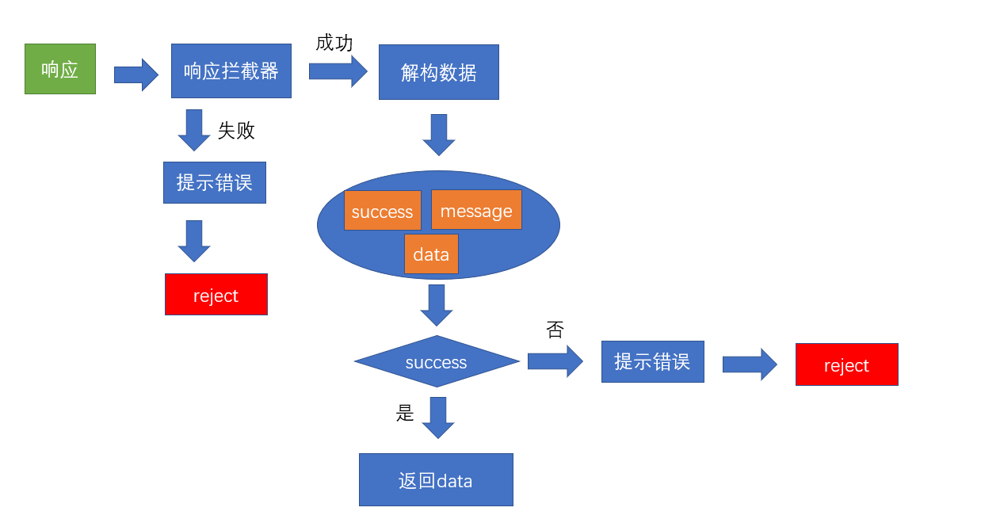

# 登录模块

[线上地址](http://ihrm-java.itheima.net/#/login)


我们看到上面的 **`process.env.port`**实际上是一个nodejs服务下的环境变量，该变量在哪里设置呢？

在项目下, 我们发现了**`.env.development`**和**`.env.production`**两个文件

development => 开发环境

production => 生产环境

当我们运行**npm run dev**进行开发调试的时候,此时会加载执行**`.env.development`**文件内容

当我们运行**npm run build:prod**进行生产环境打包的时候,会加载执行**`.env.production`**文件内容

所以,如果想要设置开发环境的接口,直接在**`.env.development`**中写入对于port变量的赋值即可

```bash
# 设置端口号
port = 8888
```

**网站名称**.

网站名称实际在**configureWebpack**选项中的**name**选项,通过阅读代码,我们会发现name实际上来源于src目录下

**`settings.js`**文件

所以,我们可以将网站名称改成"**`人力资源管理平台`**"


## Vue-Cli配置跨域代理

**`目标`**: 通过配置vue-cli的代理解决跨域访问的问题

**为什么会出现跨域？**

当下,最流行的就是**`前后分离`**项目,也就是**`前端项目`**和**`后端接口`**并不在一个域名之下，那么前端项目访问后端接口必然存在**`跨域`**的行为.



>怎么解决这种跨域 ？

**`请注意`**，我们所遇到的这种跨域是位于**开发环境**的，真正部署上线时的跨域是**生产环境**的

解决开发环境的跨域问题

**开发环境的跨域**.

开发环境的跨域，也就是在**`vue-cli脚手架环境`**下开发启动服务时，我们访问接口所遇到的跨域问题，vue-cli为我们在本地**`开启了一个服务`**,可以通过这个服务帮我们**`代理请求`**,解决跨域问题

这就是vue-cli配置**webpack的反向代理**


>采用vue-cli的代理配置

vue-cli的配置文件即**`vue.config.js`**,这里有我们需要的 [代理选项](https://cli.vuejs.org/zh/config/#devserver-proxy)

```js
module.exports = {
  devServer: {
   // 代理配置
    proxy: {
        // 这里的api 表示如果我们的请求地址有/api的时候,就出触发代理机制
        // localhost:8888/api/abc  => 代理给另一个服务器
        // 本地的前端  =》 本地的后端  =》 代理我们向另一个服务器发请求 （行得通）
        // 本地的前端  =》 另外一个服务器发请求 （跨域 行不通）
        '/api': {
        target: 'www.baidu.com', // 我们要代理的地址
        changeOrigin: true, // 是否跨域 需要设置此值为true 才可以让本地服务代理我们发出请求
         // 路径重写
        pathRewrite: {
            // 重新路由  localhost:8888/api/login  => www.baidu.com/api/login
            '^/api': '' // 假设我们想把 localhost:8888/api/login 变成www.baidu.com/login 就需要这么做 
        }
      },
    }
  }
}
```

以上就是我们在vue-cli项目中配置的代理设置

>接下来,我们在代码中将要代理的后端地址变成 [后端接口地址](http://ihrm-java.itheima.net)

```js
 // 代理跨域的配置
    proxy: {
      // 当我们的本地的请求 有/api的时候，就会代理我们的请求地址向另外一个服务器发出请求
      '/api': {
        target: 'http://ihrm-java.itheima.net/', // 跨域请求的地址
        changeOrigin: true // 只有这个值为true的情况下 才表示开启跨域
      }
    }
```

## 封装Vuex的登录Action并处理token

**`目标`**在vuex中封装登录的action,并处理token

>在这个小节中，我们将在vuex中加入对于用户的登录的处理

在Vuex中对token进行管理

在传统模式中，我们登录的逻辑很简单，如图


>上图中，组件直接和接口打交道，这并没有什么问题，但是对于用户token这一高频使用的**`钥匙`**，我们需要让vuex来介入，将用户的token状态共享，更方便的读取，如图


在**`utils/auth.js`**中,基础模板已经为我们提供了**`获取token`**,**`设置token`**,**`删除token`**的方法,可以直接使用

只需要将存储的key放置成特定值即可

```js
import Cookies from 'js-cookie'

const TokenKey = 'hrsaas-ihrm-token' // 设定一个独一无二的key

export function getToken() {
  return Cookies.get(TokenKey)
}

export function setToken(token) {
  return Cookies.set(TokenKey, token)
}

export function removeToken() {
  return Cookies.remove(TokenKey)
}
```

**初始化token状态** - **`store/modules/user.js

```js
import { getToken, setToken, removeToken } from '@/utils/auth'
// 状态
// 初始化的时候从缓存中读取状态 并赋值到初始化的状态上
// Vuex的持久化 如何实现 ？ Vuex和前端缓存相结合
const state = {
  token: getToken() // 设置token初始状态   token持久化 => 放到缓存中
}
```

**提供修改token的mutations**.

```js
// 修改状态
const mutations = {
  // 设置token
  setToken(state, token) {
    state.token = token // 设置token  只是修改state的数据  123 =》 1234
    // vuex变化 => 缓存数据
    setToken(token) // vuex和 缓存数据的同步
  },
  // 删除缓存
  removeToken(state) {
    state.token = null // 删除vuex的token
    removeToken() // 先清除 vuex  再清除缓存 vuex和 缓存数据的同步
  }
}
```

### 封装登录的Action

>登录action要做的事情,**`调用登录接口`**,**`成功后设置token到vuex`**,**`失败则返回失败`**

```js
// 执行异步
const actions = {
  // 定义login action  也需要参数 调用action时 传递过来的参数
  async login(context, data) {
    const result = await login(data) // 实际上就是一个promise  result就是执行的结果
    // axios默认给数据加了一层data
    if (result.data.success) {
      // 表示登录接口调用成功 也就是意味着你的用户名和密码是正确的
      // 现在有用户token
      // actions 修改state 必须通过mutations
      context.commit('setToken', result.data.data)
    }
  }
}
```

>上述代码中,我们使用了**`async/await`**语法,如果用**`then`**语法也是可以的

```js
 // 为什么async/await 不用返回new Promise,因为 async函数本身就是 Promise,promise的值返回的值  
login(context, data) {
    return new Promise(function(resolve) {
      login(data).then(result => {
        if (result.data.success) {
          context.commit('setToken',  result.data.data) // 提交mutations设置token
          resolve()  // 表示执行成功了
        }
      })
    })
  }
```

>以上两种写法都是OK的,我们在项目研发过程中,尽可能的采用前一种

除此之外，为了更好的让其他模块和组件更好的获取token数据，我们可以在**`store/getters.js`**中将token值作为公共的访问属性放出

```js
const getters = {
  sidebar: state => state.app.sidebar,
  device: state => state.app.device,
  token: state => state.user.token // 在根级的getters上 开发子模块的属性给别人看 给别人用
}
export default getters
```

## request中环境变量和异常的处理

### 处理axios的响应拦截器

>为什么会有环境变量之分? 如图



>从上图可以看出，开发环境实际上就是在自己的本地开发或者要求不那么高的环境，但是一旦进入生产，就是**`真实的数据`**。 拿银行作比喻，如果你在开发环境拿生产环境的接口做测试，银行系统就会发生很大的风险。

前端主要区分两个环境,**`开发环境`**,**`生产环境`**

**环境变量**.

```bash
$process.env.NODE_ENV # 当为production时为生产环境 为development时为开发环境
```

**环境文件**.

 我们可以在**`.env.development`**和**`.env.production`**定义变量，变量自动就为当前环境的值

基础模板在以上文件定义了变量**`VUE_APP_BASE_API`**，该变量可以作为axios请求的**`baseURL`**

我们会发现,在模板中,两个值分别为**`/dev-api`**和**`/prod-api`**

但是我们的开发环境代理是**`/api`**，所以可以统一下

```bash
# 开发环境的基础地址和代理对应
VUE_APP_BASE_API = '/api'
```

```bash
# 这里配置了/api,意味着需要在Nginx服务器上为该服务配置 nginx的反向代理对应/prod-api的地址 
VUE_APP_BASE_API = '/prod-api'  
```

处理axios的响应拦截器

>OK，除此之外,axios返回的数据中默认增加了一层**`data的包裹`**,我们需要在这里处理下
>并且,人资项目的接口,如果执行失败,只是设置了**`success`**为**`false`**，并没有reject，我们需要一并处理下

处理逻辑如图



```js
// 响应拦截器
service.interceptors.response.use(response => {
  // axios默认加了一层data
  const { success, message, data } = response.data
  //   要根据success的成功与否决定下面的操作
  if (success) {
    return data
  } else {
    // 业务已经错误了 还能进then ? 不能 ！ 应该进catch
    Message.error(message) // 提示错误消息
    return Promise.reject(new Error(message))
  }
}, error => {
  Message.error(error.message) // 提示错误信息
  return Promise.reject(error) // 返回执行错误 让当前的执行链跳出成功 直接进入 catch
})
```

>既然在request中已经默认去除了一层data的外衣，所以我们也将上节login的action进行一下改动

**处理登录的返回结构问题**.

```js
  async login(context, data) {
    // 经过响应拦截器的处理之后 这里的result实际上就是 token
    const result = await login(data) // 实际上就是一个promise  result就是执行的结果
    // axios默认给数据加了一层data
    // 表示登录接口调用成功 也就是意味着你的用户名和密码是正确的
    // 现在有用户token
    // actions 修改state 必须通过mutations
    context.commit('setToken', result)
  }
```
