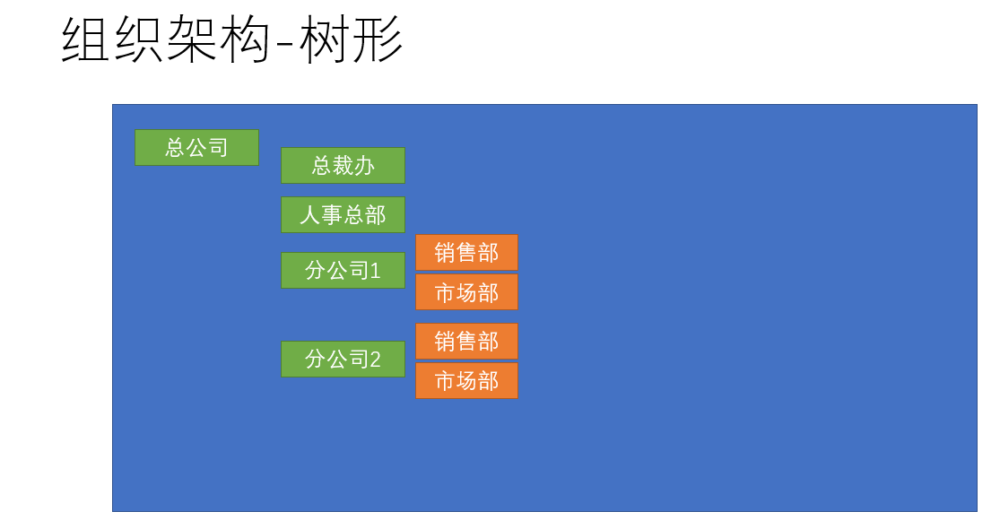

# 组织架构



## 将数组数据转化成树形结构

然后，我们需要将列表型的数据，转化成树形数据，这里需要用到**递归算法**


封装一个工具方法，**`src/utils/index.js`**

```js
/**
 * 
 * 将列表数据转化为树形
 */

function transListToTreeData(list, rootValue){
    //  list 列表   rootValue 根节点标识
    let arr = []
    list.forEach(item => {
        // 先找一个头，再找这个头之下的 
        if(item.pid === rootValue){
            // 判断是否有子节点
            const children = transListToTreeData(list, item.id)
            if(children.length){
                // 有子节点,将子节点与父节点相关联
                item.children = children
            }
            // 数组push进item结果
            arr.push(item)
        }
    })
    return arr
}
```

### 通知父组件更新1

方法1：通过触发自定义事件来进行`this.$emit`

## 新增 `部门名称` 和 `部门编码` 的自定义校验

在添加部门名称或者部门编码是我们要检验该名称或者该编码是否已经存在，这需要一个特殊的校验规则
部门名称和部门编码通过**自定义校验函数validator**来实现

>首先，在校验名称和编码时，要获取最新的组织架构，这也是我们这里trigger采用blur的原因，因为change对于访问的频率过高，我们需要控制访问频率

根据当前部门id，找到所有子部门相关的数据，判断是否重复

```js
// 此函数作用：去找在同级部门下是否有相同名称的部门已存在
const checkNameRepeat = async(rule,value,callback) => {
    // 先获取最新的组织架构数据
    const { depts } = await getDepartments()
    // 先根据当前部门id，找到所有子部门相关的数据,再找出该部门下是否有重复名称
    const isRepeat = depts.filter(item => item.pid === this.treeNode.id).some(item => item.name === value)
    return isRepeat ? callback(new Error(`同级目录下已存在${value}部门`)) : callback()
}
```

> 检查部门编码的过程同理

### 通知父组件更新2

方法2：利用sync修饰符

按照常规，想要让父组件更新**`showDialog`**的话，需要这样做

```js
// 子组件
this.$emit('changedialog', false) //触发事件
// 父组件
<child @changedialog="method" :showDialog="showDialog" />
 method(value) {
    this.showDialog = value
}
```

>但是，vuejs为我们提供了**`sync修饰符`**，它提供了一种简写模式 也就是

```js
// 子组件update:固定写法（update:props名称，值）
this.$emit('update:showDialog',false)
// 父组件 sync修饰符
<child :showDialog.sync='showDialog'/>
```

## 根据计算属性显示控制标题

```js
computed: {
    showTitle() {
      return this.formData.id ? '编辑部门' : '新增子部门'
    }
  }
```

同时发现，el-form中的resetFields不能重置非表单中的数据，所以在取消的位置需要强制加上 重置数据

```js
 btnCancel() {
      // 重置数据  因为resetFields 只能重置 表单上的数据 非表单上的 比如 编辑中id 不能重置
      this.formData = {
        name: '',
        code: '',
        manager: '',
        introduce: ''
      }
      // 关闭弹层
      this.$emit('update:showDialog', false)
      // 清除之前的校验  可以重置数据 只能重置 定义在data中的数据
      this.$refs.deptForm.resetFields()
    }
```

## 校验规则支持编辑场景下的校验

>除此之外，我们发现原来的校验规则实际和编辑部门有些冲突，所以需要进一步处理

```js
 // 现在定义一个函数 这个函数的目的是 去找 同级部门下 是否有重复的部门名称
    const checkNameRepeat = async(rule, value, callback) => {
      // 先要获取最新的组织架构数据
      const { depts } = await getDepartments()
      //  检查重复规则 需要支持两种 新增模式 / 编辑模式
      // depts是所有的部门数据
      // 如何去找技术部所有的子节点
      let isRepeat = false
      if (this.formData.id) {
        // 有id就是编辑模式
        // 编辑 张三 => 校验规则 除了我之外 同级部门下 不能有叫张三的
        isRepeat = depts.filter(item => item.id !== this.formData.id && item.pid === this.treeNode.pid).some(item => item.name === value)
      } else {
        // 没id就是新增模式
        isRepeat = depts.filter(item => item.pid === this.treeNode.id).some(item => item.name === value)
      }

      isRepeat ? callback(new Error(`同级部门下已经有${value}的部门了`)) : callback()
    }
    // 检查编码重复
    const checkCodeRepeat = async(rule, value, callback) => {
      // 先要获取最新的组织架构数据
      //  检查重复规则 需要支持两种 新增模式 / 编辑模式
      const { depts } = await getDepartments()
      let isRepeat = false
      if (this.formData.id) {
        // 编辑模式  因为编辑模式下 不能算自己
        isRepeat = depts.some(item => item.id !== this.formData.id && item.code === value && value)
      } else {
        // 新增模式
        isRepeat = depts.some(item => item.code === value && value) // 这里加一个 value不为空 因为我们的部门有可能没有code
      }

      isRepeat ? callback(new Error(`组织架构中已经有部门使用${value}编码`)) : callback()
    }
```
