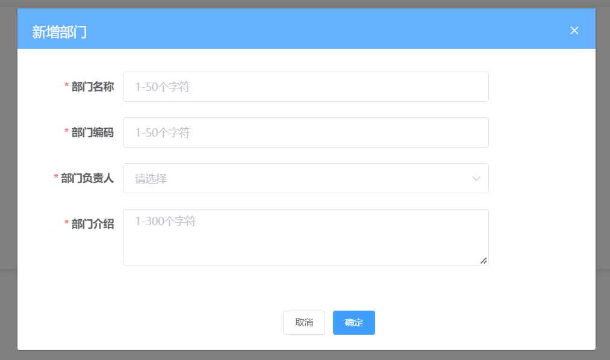

# 弹窗表单提交与取消监听事件及函数



如上图再点击确定按钮时我么可给`确定`按钮一个`btnOK`的click事件，同样给`取消`按钮一个`btnCancel`的click事件

主动执行表单校验，需要获取表单的DOM属性，所以我们给表单一个ref属性 ref="deptForm"

`btnOK`函数可以在methods中这样来写

```js
btnOK() {
    // 获取表单DOM,并主动检验
    // 这里有三种写法
    // 第一种 通过回调函数
    this.$refs.deptForm.validate(isOK =>{
        // 如果校验成功isOK为true，反之为false并触发校验失败message警告
        if(isOK){
            ... // 校验成功执行的函数
        }
    })
    // 第二种 通过其本身返回Promise的特性
    this.$refs.deptForm.validate().then(()=>{
        ... // 校验成功执行的函数
    }).catch((){

    })
    // 第三种 通过async和await
    // 外层函数用async修饰
    await this.$refs.deptForm.validate()
    ... // 校验成功执行的函数

    // 最后将弹层visible属性设为false以关闭弹层
}
```

`btnCancel`函数可以在methods中这样来写

```js
btnCancel() {
    // 先重置表单数据
    this.depForm = {
        ... // 将表单各项属性置空
    }
    // 重置表单校验
    this.$refs.deptForm.resetFields()
    // 再将弹出层的visible属性设为false以关闭弹层
}
```

>将弹层属性的close事件监听到btnCancel函数，在执行btnOK函数后关闭弹层后也会触发一次close事件，即执行一次btnCancel函数
