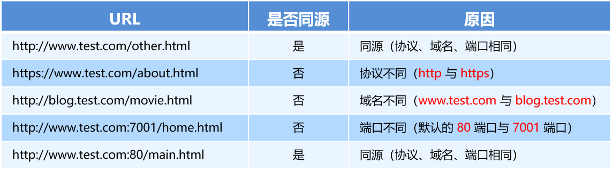
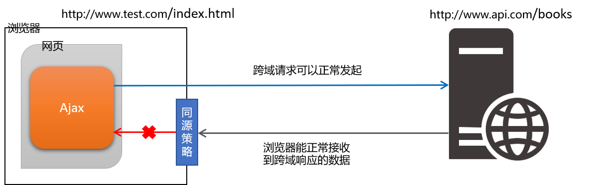

# 跨域与JSONP

## 1. 了解同源策略和跨域

### 1.1 同源策略

#### 1. 什么是同源

如果两个页面的协议，域名和端口都相同，则两个页面具有相同的源。
例如，下表给出了相对于`http://www.test.com/index.html`页面的同源检测：



#### 2. 什么是同源策略

同源策略（英文全称 Same origin policy）是浏览器提供的一个安全功能。

> MDN 官方给定的概念：同源策略限制了从同一个源加载的文档或脚本如何与来自另一个源的资源进行交互。这是一个用于隔离潜在恶意文件的重要安全机制。

通俗的理解：浏览器规定，A 网站的 JavaScript，不允许和非同源的网站 C 之间，进行资源的交互，例如：

- 无法读取非同源网页的 Cookie、LocalStorage 和 IndexedDB
- 无法接触非同源网页的 DOM
- 无法向非同源地址发送 Ajax 请求

### 1.2 跨域

#### 1. 什么是跨域

同源指的是两个 URL 的协议、域名、端口一致，反之，则是跨域。
出现跨域的根本原因：浏览器的同源策略不允许非同源的 URL 之间进行资源的交互。
网页：`http://www.test.com/index.html`
接口：`http://www.api.com/userlist`

#### 2. 浏览器对跨域请求的拦截



注意：浏览器允许发起跨域请求，但是，跨域请求回来的数据，会被浏览器拦截，无法被页面获取到！

#### 3. 如何实现跨域数据请求

现如今，实现跨域数据请求，最主要的两种解决方案，分别是 JSONP 和 CORS。
JSONP：出现的早，兼容性好（兼容低版本IE）。是前端程序员为了解决跨域问题，被迫想出来的一种临时解决方案。缺点是只支持 GET 请求，不支持 POST 请求。
CORS：出现的较晚，它是 W3C 标准，属于跨域 Ajax 请求的根本解决方案。支持 GET 和 POST 请求。缺点是不兼容某些低版本的浏览器。

## 2.JSONP

### 2.1 什么是JSONP

JSONP (JSON with Padding) 是 JSON 的一种“使用模式”，可用于解决主流浏览器的跨域数据访问的问题。

### 2.2 JSONP的实现原理

由于浏览器同源策略的限制，网页中无法通过 Ajax 请求非同源的接口数据。但是` <script> `标签不受浏览器同源策略的影响，可以通过 src 属性，请求非同源的 js 脚本。

&nbsp;

因此，JSONP 的实现原理，就是通过 `<script>` 标签的 src 属性，请求跨域的数据接口，并通过函数调用的形式，接收跨域接口响应回来的数据。

### 2.3 自己实现一个简单的JSONP

定义一个 success 回调函数：

```js
<script>
   function success(data) {
     console.log('获取到了data数据：')
     console.log(data)
   }
 </script>
```

通过` <script> `标签，请求接口数据：

```js
<script src="http://ajax.frontend.itheima.net:3006/api/jsonp?callback=success&name=zs&age=20"></script>
```

### 2.4 JSONP的缺点

由于 JSONP 是通过` <script> `标签的 src 属性，来实现跨域数据获取的，所以，JSONP 只支持 GET 数据请求，不支持 POST 请求。

> 注意：JSONP 和 Ajax 之间没有任何关系，不能把 JSONP 请求数据的方式叫做 Ajax，因为 JSONP 没有用到 XMLHttpRequest 这个对象。
