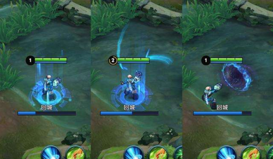
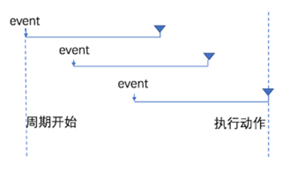
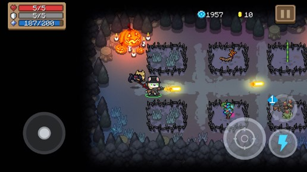
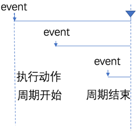

# 防抖与节流

## 输入框防抖

### 1.什么是防抖

防抖策略（debounce）是当事件被触发后，延迟 n 秒后再执行回调，如果在这 n 秒内事件又被触发，则重新计时。


&nbsp;


### 2.防抖的应用场景

用户在输入框中连续输入一串字符时，可以通过防抖策略，只在输入完后，才执行查询的请求，这样可以有效减少请求次数，节约请求资源；

### 3. 实现输入框的防抖

```js
 var timer = null                    // 1. 防抖动的 timer

 function debounceSearch(keywords) { // 2. 定义防抖的函数
    timer = setTimeout(function() {
    // 发起 JSONP 请求
    getSuggestList(keywords)
    }, 500)
 }

 $('#ipt').on('keyup', function() {  // 3. 在触发 keyup 事件时，立即清空 timer
    clearTimeout(timer)
    // ...省略其他代码
    debounceSearch(keywords)
 })
```

## 缓存搜索的建议列表

### 1. 定义全局缓存对象

```js
// 缓存对象
  var cacheObj = {}
```

### 2. 将搜索结果保存到缓存对象中

```js
// 渲染建议列表
 function renderSuggestList(res) {
    // ...省略其他代码
    // 将搜索的结果，添加到缓存对象中
    var k = $('#ipt').val().trim()
    cacheObj[k] = res
 }
```

### 3.优先从缓存中获取搜索建议

```js
// 监听文本框的 keyup 事件
 $('#ipt').on('keyup', function() {
    // ...省略其他代码

    // 优先从缓存中获取搜索建议
    if (cacheObj[keywords]) {
       return renderSuggestList(cacheObj[keywords])
    }
    // 获取搜索建议列表
    debounceSearch(keywords)
  })
```

## 节流

### 1.什么是节流

节流策略（throttle），顾名思义，可以减少一段时间内事件的触发频率。


&nbsp;


### 2.节流的应用场景

1. 鼠标连续不断地触发某事件（如点击），只在单位时间内只触发一次；
2. 懒加载时要监听计算滚动条的位置，但不必每次滑动都触发，可以降低计算的频率，而不必去浪费 CPU 资源；

### 3.节流阀的概念

> 高铁卫生间是否被占用，由红绿灯控制，红灯表示被占用，绿灯表示可使用。
假设每个人上卫生间都需要花费5分钟，则五分钟之内，被占用的卫生间无法被其他人使用。
上一个人使用完毕后，需要将红灯重置为绿灯，表示下一个人可以使用卫生间。
下一个人在上卫生间之前，需要先判断控制灯是否为绿色，来知晓能否上卫生间。
> 节流阀为空，表示可以执行下次操作；不为空，表示不能执行下次操作。
当前操作执行完，必须将节流阀重置为空，表示可以执行下次操作了。
每次执行操作前，必须先判断节流阀是否为空。

### 4.使用节流优化鼠标跟随效果

```js
$(function() {
  var angel = $('#angel')
  var timer = null // 1.预定义一个 timer 节流阀
  $(document).on('mousemove', function(e) {
    if (timer) { return } // 3.判断节流阀是否为空，如果不为空，则证明距离上次执行间隔不足16毫秒
    timer = setTimeout(function() {
      $(angel).css('left', e.pageX + 'px').css('top', e.pageY + 'px')
      timer = null // 2.当设置了鼠标跟随效果后，清空 timer 节流阀，方便下次开启延时器
    }, 16)
  })
})
```

## 总结防抖和节流的区别

- 防抖：如果事件被频繁触发，防抖能保证只有最有一次触发生效！前面 N 多次的触发都会被忽略！
- 节流：如果事件被频繁触发，节流能够减少事件触发的频率，因此，节流是有选择性地执行一部分事件！
