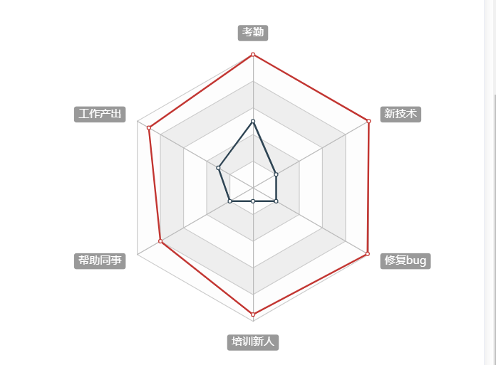

# 封装雷达图图表组件

## 封装雷达图插件

第一步， 安装echarts图表

```bash
npm i echarts
```

>echarts是一个很大的包，里面包含了众多图形，假设我们只使用雷达图，可以做按需加载

第二步， 新建雷达图组件，**`src/components/radar.vue`**

```vue
<template>
  <!-- 雷达图  图表必须给高和宽度-->
  <div ref="myDiv" class="radar-echart" />
</template>

<script>
// 完成加载过程
// var echarts = require('echarts')
var echarts = require('echarts/lib/echarts') // 引入echarts主模块
require('echarts/lib/chart/radar') // 引入雷达图
// 引入提示框和标题组件
require('echarts/lib/component/tooltip')
require('echarts/lib/component/title')

export default {
  // 页面渲染完毕事件
  mounted() {
    const myChart = echarts.init(this.$refs.myDiv) // 得到图表实例
    myChart.setOption({
      title: {
        text: '基础雷达图'
      },
      tooltip: {},
      legend: {
        data: ['预算分配（Allocated Budget）', '实际开销（Actual Spending）']
      },
      radar: {
        // shape: 'circle',
        name: {
          textStyle: {
            color: '#fff',
            backgroundColor: '#999',
            borderRadius: 3,
            padding: [3, 5]
          }
        },
        // 每个区域的最高值
        indicator: [
          { name: '工作效率', max: 100 },
          { name: '考勤', max: 100 },
          { name: '积极性', max: 100 },
          { name: '帮助同事', max: 100 },
          { name: '自主学习', max: 100 },
          { name: '正确率', max: 100 }
        ]
      },
      series: [{
        name: '预算 vs 开销（Budget vs spending）',
        type: 'radar',
        // areaStyle: {normal: {}},
        data: [
          {
            value: [10, 1, 100, 5, 100, 0],
            name: '张三'
          },
          {
            value: [50, 50, 50, 50, 50, 10],
            name: '李四'
          }
        ]
      }]
    })
  }
}
</script>

<style>
.radar-echart {
    width: 600px;
    height: 400px;
}
</style>
```

我们得到一个雷达图，对绩效指数进行统计



**在主页中引入使用**.
